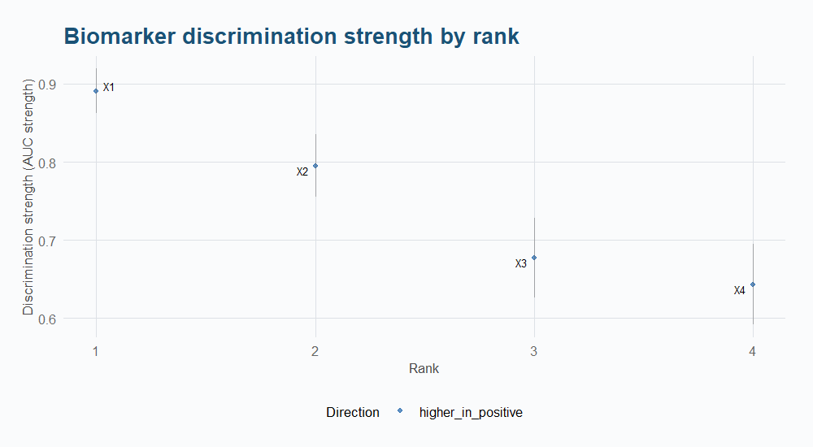
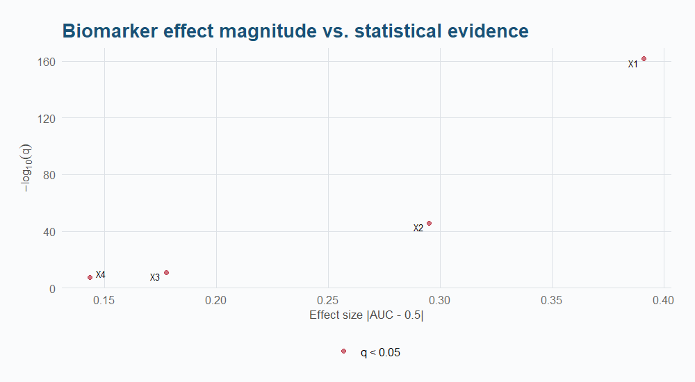
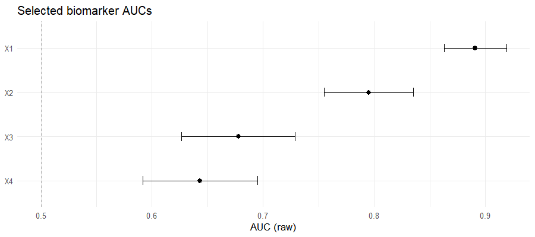
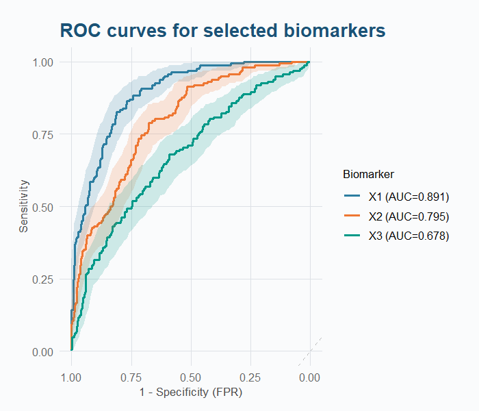
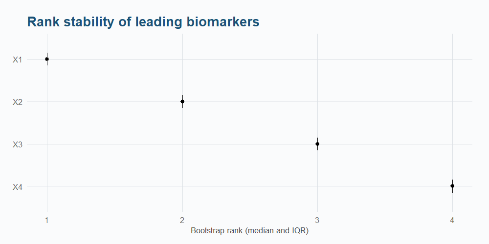

# aucmat

[](https://lifecycle.r-lib.org/articles/stages.html)
[](https://github.com/vanhungtran/aucmat/actions/workflows/R-CMD-check.yaml)
[](https://opensource.org/licenses/MIT)

**Scalable and statistically principled ROC analysis for high-dimensional biomarker matrices in R.**

`aucmat` is a matrix-first R package for univariate screening and ranking of
molecular biomarkers (genes, proteins, metabolites) measured on the same
subjects. It reports **direction-preserving AUCs** with DeLong and
stratified-bootstrap inference, multiplicity adjustment, paired comparisons
(superiority, non-inferiority, equivalence), omnibus global testing, bootstrap
rank-stability analysis, and a multivariate simulation engine with validation.

## Installation

```r
remotes::install_github("vanhungtran/aucmat")
```

## Validated on Real Data

`aucmat` ships real plasma Olink proteomics from BeatMG (NeuroNEXT NN102), a
randomized, placebo-controlled trial of rituximab (an anti-CD20, B-cell-depleting
antibody) for myasthenia gravis:

```r
data(beatmg_baseline)     # pre-treatment, n = 48
data(beatmg_ontreatment)  # on-treatment, n = 44
protein_cols <- setdiff(names(beatmg_ontreatment), c("SampleID", "arm"))

fit <- aucmat(as.matrix(beatmg_ontreatment[, protein_cols]),
  beatmg_ontreatment$arm, positive = "Rituximab", ci = "delong", adjust = "BH")
```

Screening the pre-treatment matrix finds **0/730** significant proteins
(the expected null result under randomization). Screening on-treatment finds
**8/730** at q < 0.05, all systematically lower under rituximab — six are
canonical B-cell surface/signaling markers (`FCRL2`, `CD22`, `TNFRSF13C`/BAFF-R,
`TNFRSF13B`/TACI, `CD79B`, `CD72`), the expected pharmacodynamic signature of
anti-CD20 B-cell depletion. See the
[Real-Data Application](https://vanhungtran.github.io/aucmat/articles/real-data-beatmg.html)
vignette for the full analysis, DeLong-vs-bootstrap cross-check, and
bootstrap rank-stability validation.

## Function Reference

| Category | Function | Description |
|----------|----------|-------------|
| **Screening** | `aucmat()` | Screen all biomarkers against a binary outcome |
| | `cv_aucmat()` | Cross-validated AUC screening (out-of-fold) |
| | `aucmat_by()` | Stratified screening by group with heterogeneity |
| | `aucmat_multiclass()` | One-vs-rest + Hand-Till multiclass AUC |
| | `hurdle_auc()` | Two-stage AUC for zero-inflated data |
| **Inference** | `compare_auc()` | Paired AUC comparisons (superiority, NI, equivalence) |
| | `compare_auc_global()` | Omnibus Wald test: H0 all AUCs equal |
| | `auc_stability()` | Bootstrap rank-stability analysis |
| | `roc_test()` | Single-biomarker DeLong test with clean summary |
| **Simulation** | `simulate_auc_matrix()` | Class-conditional MVN, named correlation structures |
| | `simulate_auc_copula()` | Gaussian copula + iterative AUC perturbation |
| | `simulate_hurdle_auc()` | Zero-inflated data (Bernoulli hurdle + log-normal) |
| | `validate_simulation()` | Repeated-draw calibration check |
| | `generate_data_probit()` | Latent probit: independent AUC + correlation |
| | `generate_data_analytical()` | Sequential binormal: fast, AUC-correlation linked |
| | `generate_auc_vector()` | Single score with exact empirical AUC |
| | `generate_auc_cor_vector()` | Single score with exact AUC + approximate Pearson r |
| | `simulate_auc_correlation()` | Monte Carlo sampling distribution of (AUC, r) |
| **Panels & Power** | `fit_auc_panel()` | Multivariable panel scores (ridge/lasso/elastic-net) |
| | `power_auc_matrix()` | Sample size and power for AUC comparisons |
| **Visualization** | `plot_auc_rank()` | Ordered discrimination strengths with CIs |
| | `plot_auc_volcano()` | Effect magnitude vs statistical evidence |
| | `plot_auc_forest()` | Selected AUCs with confidence intervals |
| | `plot_auc_stability()` | Bootstrap rank distributions |
| | `plot_roc_top()` | ROC curves for selected biomarkers |
| | `plot_roc_smooth()` | Smoothed (binormal) ROC curves |
| | `plot_auc_pr()` | Precision-Recall curves for imbalanced data |
| | `plot_correlation_heatmap()` | Requested vs achieved correlation |
| | `plot_hurdle_diagnostics()` | Zero-inflation vs magnitude discrimination |
| **S3 Methods** | `print()`, `summary()` | Display and summarise results |
| | `as.data.frame()` | Convert screening results to data.frame |
| | `plot()` | Default plot per object class |
| | `subset()` | Filter screening results |

## Quick Start

```r
library(aucmat)

# 1. Generate correlated biomarkers with controlled AUCs
sim <- generate_data_probit(
  n = 500, prevalence = 0.3,
  target_aucs = c(0.90, 0.80, 0.70),
  corr_matrix  = matrix(c(1, 0.3, 0.1, 0.3, 1, 0.2, 0.1, 0.2, 1), 3, 3)
)

# 2. Screen all biomarkers
fit <- aucmat(sim$data[, 1:3], sim$data$truth)
print(fit)

# 3. Visualize
plot_auc_rank(fit)       # ordered discrimination strengths
plot_auc_volcano(fit)    # effect vs evidence
plot_auc_forest(fit)     # multiple AUCs with CIs
plot_roc_top(fit, X = sim$data[, 1:3], y = sim$data$truth)

# 4. Compare AUCs — three comparison modes
compare_auc(fit, sim$data[, 1:3], sim$data$truth, top_n = 3)          # all pairs
compare_auc(fit, sim$data[, 1:3], sim$data$truth, reference = "X1")   # vs reference
compare_auc(fit, sim$data[, 1:3], sim$data$truth,
  biomarkers = c("X1", "X2"))                                         # named set

# 5. Global test — are all AUCs equal?
compare_auc_global(fit, sim$data[, 1:3], sim$data$truth)

# 6. Assess rank stability
stab <- auc_stability(sim$data[, 1:3], sim$data$truth, times = 500, seed = 42)
plot_auc_stability(stab)
```

---

## 1. Screening: `aucmat()`

`aucmat()` computes direction-preserving AUCs for every biomarker column
against a binary outcome. It supports DeLong or bootstrap inference,
multiplicity adjustment, and feature-wise or complete-case missing-data
handling.

```r
fit <- aucmat(X, y)                                       # default: DeLong, BH
fit <- aucmat(X, y, ci = "bootstrap", boot_n = 2000)      # bootstrap CIs
fit <- aucmat(X, y, ci = "none")                          # no inference (fastest)
fit <- aucmat(X, y, adjust = "bonferroni")                # stricter adjustment
fit <- aucmat(X, y, na_action = "complete")               # complete-case only
fit <- aucmat(X, y, retain_data = TRUE)                   # keep data for plotting
```

### Result Columns

| Column | Description |
|--------|-------------|
| `biomarker` | Column name |
| `auc_raw` | AUC on observed direction (may be < 0.5) |
| `auc_strength` | 0.5 + \|auc_raw − 0.5\| — always ≥ 0.5 |
| `effect_direction` | `higher_in_positive` or `lower_in_positive` |
| `std_error` | DeLong or bootstrap standard error |
| `conf_low`, `conf_high` | Confidence interval |
| `p_value`, `q_value` | Raw and multiplicity-adjusted p-values |
| `rank` | Ordered by `auc_strength` descending |
| `n_used`, `n_pos`, `n_neg` | Sample counts per biomarker |
| `n_missing`, `missing_fraction` | Missing data diagnostics |
| `status` | `ok`, `constant`, `insufficient_positive`, etc. |
| `warning` | `small_class_counts`, `high_missingness`, etc. |

### S3 Methods

```r
print(fit)               # compact top-N display
summary(fit)             # class counts, statuses, missingness, multiplicity
as.data.frame(fit)       # raw results table
plot(fit)                # alias for plot_auc_rank(fit)
subset(fit, q_value < 0.05)   # filter by significance
subset(fit, auc_strength > 0.8)  # filter by discrimination
```

---

## 2. Visualization

Every plot returns a `ggplot2` object and labels only a limited subset of
biomarkers (via `ggrepel`) to keep wide-matrix views readable.

### 2.1 Rank Plot — `plot_auc_rank()`

Ordered discrimination strengths with optional DeLong CI error bars.
Colour indicates effect direction (blue = higher in positives, red = lower).

```r
plot_auc_rank(fit, n_label = 20, show_ci = TRUE)
```



### 2.2 Volcano Plot — `plot_auc_volcano()`

Effect magnitude (\|AUC − 0.5\|) against statistical evidence (−log₁₀ q).
Biomarkers with q < cutoff are highlighted in red.

```r
plot_auc_volcano(fit, n_label = 20, q_cutoff = 0.05)
```



### 2.3 Forest Plot — `plot_auc_forest()`

Point estimates with confidence intervals for selected biomarkers.

```r
plot_auc_forest(fit, n = 8)                          # top 8 by auc_strength
plot_auc_forest(fit, biomarkers = c("X1", "X2"))     # specific set
```



### 2.4 ROC Curves — `plot_roc_top()`

Empirical ROC curves for deliberately selected biomarkers. Supports optional
bootstrap CI ribbons.

```r
plot_roc_top(fit, X = X, y = y)                            # top 6 by default
plot_roc_top(fit, X = X, y = y, biomarkers = c("X1", "X2"))
plot_roc_top(fit, X = X, y = y, add_ci = TRUE, boot_n = 500)  # with CI ribbons
```



### 2.5 Stability Plot — `plot_auc_stability()`

Bootstrap rank distributions with median (point) and IQR (error bar).

```r
plot_auc_stability(stab, n_label = 20)
```



---

## 3. Paired Comparisons: `compare_auc()`

`compare_auc()` tests AUC differences between biomarkers measured on the
**same subjects**. It supports three selection modes, three hypothesis types,
and DeLong or bootstrap inference.

### Comparison Modes

| Mode | Argument | Description |
|------|----------|-------------|
| Reference | `reference = "X1"` | Every other biomarker vs one reference |
| Top-N | `top_n = 5` | All pairs among the top N (flagged exploratory) |
| Named set | `biomarkers = c("a","b","c")` | All pairs within a specific list |

### Hypothesis Types

| Hypothesis | `hypothesis` | H0 | Use case |
|------------|-------------|-----|----------|
| Superiority | `"superiority"` | Δ = 0 | Is one biomarker better? |
| Non-inferiority | `"noninferiority"` | Δ ≤ −margin | Is one at least as good? |
| Equivalence (TOST) | `"equivalence"` | Δ ≤ −m or Δ ≥ m | Are they practically the same? |

With `alternative = "two.sided"` (default), `"greater"`, or `"less"`.

```r
# Two-sided superiority (default)
compare_auc(fit, X, y, reference = "X1")

# Directional: H0: AUC_a ≤ AUC_b (biomarker a is no better than b)
compare_auc(fit, X, y, reference = "X1", alternative = "greater")

# Non-inferiority: H0: AUC_a is worse than AUC_b by at least 0.05
compare_auc(fit, X, y, reference = "X1",
  hypothesis = "noninferiority", margin = 0.05)

# Equivalence (TOST): are AUCs within ±0.15?
compare_auc(fit, X, y, reference = "X1",
  hypothesis = "equivalence", margin = 0.15)
```

**Output columns**: `biomarker_a`, `biomarker_b`, `auc_a`, `auc_b`,
`auc_diff`, `std_error`, `conf_low`, `conf_high`, `p_value`, `q_value`,
`n_common`, `n_pos`, `n_neg`, `hypothesis`, `margin`.

When `top_n` selects and tests on the same data, the result carries
`selection_status = "same_data"` and a warning that inference is exploratory.

### Multiplicity Adjustment

```r
compare_auc(fit, X, y, top_n = 5, adjust = "BH")
compare_auc(fit, X, y, reference = "X1", adjust = "holm")
compare_auc(fit, X, y, biomarkers = c("X1","X2","X3"), adjust = "bonferroni")
```

---

## 4. Global Test: `compare_auc_global()`

Tests H₀: AUC₁ = AUC₂ = … = AUCₚ on a common subject set using the
joint DeLong covariance matrix and a Wald statistic.

```r
global <- compare_auc_global(fit, X, y)              # all biomarkers
global <- compare_auc_global(fit, X, y,
  biomarkers = c("X1", "X2", "X3"))                   # selected set
print(global)
```

Output: χ² statistic, degrees of freedom, p-value, per-biomarker AUC
estimates, covariance matrix, contrast specification, and sample counts.
The default safety limit is 100 biomarkers; raise it with `max_biomarkers`.

With two biomarkers, the global Wald statistic equals the squared
paired-DeLong z statistic (within numerical tolerance).

---

## 5. Rank Stability: `auc_stability()`

Quantifies how much bootstrap-determined ranks change under sampling
variability. Resamples positive and negative subjects separately with
replacement.

```r
stab <- auc_stability(X, y, times = 1000, top_k = c(10, 25, 50), seed = 42)
print(stab)              # median rank, Q25/Q75, top-1 frequency, mean/SD AUC
head(stab$rank_summary)  # full rank-distribution summary
head(stab$top_k_probs)   # top-k selection probabilities
stab$coselection          # pairwise co-selection frequencies
```

---

## 6. Hurdle-AUC: Zero-Inflated Biomarker Data

Standard AUC assumes continuous data following a shifted normal distribution
per class.  This breaks on zero-inflated data (scRNA-seq, microbiome,
detection-limited assays) where 60%+ of values are exactly zero.  Under the
standard model, zeros come from the tail of N(0,1) below 0 — biologically
implausible.  The Hurdle-AUC models zeros and expression magnitudes as
**separate biological processes**:

**Stage 1** — Zero or expressed?  P(X=0 | class) via logistic regression.  
**Stage 2** — If expressed, at what level?  Standard AUC on nonzero values only.

```r
# scRNA-seq: 62% zeros in controls, 25% in cases
sim <- simulate_hurdle_auc(
  n = 500, prevalence = 0.3,
  target_hurdle_aucs = c(0.85, 0.72, 0.55),
  zero_rate_neg = c(0.55, 0.30, 0.80),
  zero_rate_pos = c(0.25, 0.10, 0.70)
)

# Standard AUC misses the signal
fit_std <- aucmat(as.matrix(sim$data[, 1:3]), sim$data$truth, ci = "none")
# Hurdle AUC recovers it (+69% improvement)
fit_hur <- hurdle_auc(as.matrix(sim$data[, 1:3]), sim$data$truth)

# Diagnostics: zero discrimination vs magnitude discrimination
plot_hurdle_diagnostics(fit_hur)
```

| Metric | Standard AUC | Hurdle AUC | Why |
|--------|:-----------:|:----------:|-----|
| Biomarker 1 | ~0.53 | **~0.90** | 55%→25% zero rate shift + strong nonzero signal |
| Biomarker 2 | ~0.65 | **~0.72** | 30%→10% zero rate shift + moderate signal |
| Biomarker 3 | ~0.52 | ~0.55 | 80%→70% zero rate shift (weak discrimination) |

## 7. Simulation

`aucmat` provides nine simulation functions. The core distinction is whether
AUC and between-biomarker correlation are **independent** (free parameters) or
**linked** (determined by the binormal constraint).

### 7.1 Simulator Comparison

| Function | AUC + Correlation | Approach | Speed |
|----------|-------------------|----------|-------|
| `simulate_auc_matrix()` | **Independent** | Class-conditional MVN, named correlation structures | Fast |
| `simulate_auc_copula()` | **Independent** | Gaussian copula + iterative AUC perturbation | Moderate |
| `generate_data_probit()` | **Independent** | Latent MVN, numerical ρ calibration | Slower |
| `simulate_hurdle_auc()` | **Zero-inflated** | Bernoulli hurdle + log-normal magnitude | Moderate |
| `generate_data_analytical()` | **Linked** | Sequential binormal decomposition | Fast |
| `generate_auc_vector()` | **AUC only** | Rank construction, exact finite-sample AUC | Instant |
| `generate_auc_cor_vector()` | **AUC exact, r approx** | Rank + Box-Cox tuning | Fast |
| `simulate_auc_correlation()` | Sampling distribution | Monte Carlo over binormal draws | Moderate |
| `validate_simulation()` | Calibration check | Repeated independent draws + diagnostics | Slow |

### 6.2 `simulate_auc_matrix()` — Recommended General-Purpose Simulator

Draws biomarkers class-conditionally: X\|Y=0 ~ MVN(μ₀, R), X\|Y=1 ~ MVN(μ₁, R).
The outcome Y is fixed **before** any biomarker is drawn — supplied outcomes
keep their exact values and row order; generated outcomes get exact class
counts by default.

```r
# Exchangeable: all off-diagonal entries equal
sim_ex <- simulate_auc_matrix(
  n = 500, prevalence = 0.3,
  target_aucs = c(0.9, 0.8, 0.7, 0.65),
  correlation = 0.4, structure = "exchangeable"
)

# AR(1): correlation decays with distance |i−j|
sim_ar1 <- simulate_auc_matrix(
  n = 500, prevalence = 0.3,
  target_aucs = c(0.9, 0.8, 0.7, 0.65),
  correlation = 0.6, structure = "ar1"
)

# Block: within-block and between-block correlations
sim_blk <- simulate_auc_matrix(
  n = 500, prevalence = 0.3,
  target_aucs = c(0.9, 0.8, 0.7, 0.65),
  structure = "block", block_sizes = c(2, 2),
  rho_within = 0.6, rho_between = 0.1
)

# User-supplied matrix
sim_usr <- simulate_auc_matrix(
  n = 500, prevalence = 0.3,
  target_aucs = c(0.9, 0.8, 0.7),
  correlation = matrix(c(1, 0.3, 0.1, 0.3, 1, 0.2, 0.1, 0.2, 1), 3, 3),
  structure = "user"
)

# Supplied outcome (retains exact values and row order)
y_supplied <- rbinom(500, 1, 0.3)
sim_y <- simulate_auc_matrix(
  y = y_supplied,
  target_aucs = c(0.9, 0.8, 0.7), correlation = 0.3, structure = "exchangeable"
)
```

**Correlation structures:**

| `structure` | Parameters | Off-diagonal entries |
|-------------|-----------|---------------------|
| `"user"` | `correlation` = full matrix | As supplied |
| `"exchangeable"` | `correlation` = single value | Constant ρ everywhere |
| `"ar1"` | `correlation` = single value | ρ^{\|i−j\|} |
| `"block"` | `block_sizes`, `rho_within`, `rho_between` | Block-diagonal |

**Feasibility diagnostics:** When the requested correlation matrix is not
positive definite, `feasibility = "error"` (default) stops with a structured
condition. `feasibility = "nearest"` projects to the nearest valid matrix and
reports the adjustment magnitude in `$feasibility`.

### 6.3 `validate_simulation()` — Calibration Check

Repeats a `simulate_auc_matrix()` specification across many independent draws
and reports bias, RMSE, Monte Carlo standard error, and target-interval hit
rates for both AUCs and pairwise correlations. A single draw is never evidence
that a simulator is calibrated.

```r
val <- validate_simulation(
  n = 300, prevalence = 0.3,
  target_aucs = c(0.85, 0.75, 0.65),
  correlation = 0.3, structure = "exchangeable",
  times = 100, seed = 1
)
print(val)
# $auc_bias, $auc_rmse, $auc_mc_se, $auc_hit_rate per biomarker
# $correlation$bias, $correlation$rmse, $correlation$mc_se, $correlation$hit_rate
```

A bias that stays large relative to the Monte Carlo SE across replicates
signals a calibration problem, not sampling noise.

### 6.4 Other Simulators

```r
# Latent probit: independent AUC + correlation (numerical calibration)
generate_data_probit(n = 500, target_aucs = c(0.9, 0.8, 0.7),
  corr_matrix = diag(3) + 0.3 - diag(0.3, 3), prevalence = 0.3)

# Binormal sequential: fast, AUC-correlation linked
generate_data_analytical(n = 500, target_aucs = c(0.85, 0.75, 0.65),
  corr_matrix = diag(3), prevalence = 0.3)

# Single score with exact empirical AUC
generate_auc_vector(y, target_auc = 0.80)

# Single score with exact AUC + approximate Pearson r
generate_auc_cor_vector(y, target_auc = 0.80, target_cor = 0.45)

# Monte Carlo sampling distribution of (AUC, r) under binormal model
simulate_auc_correlation(y, target_auc = c(0.7, 0.8, 0.9), n_sim = 500)
```

### 6.5 How Simulation Works

Under the **binormal model**, biomarker values are normally distributed in
each class, shifted apart:

```
Negative class:  X | Y=0  ~  N(μ₀, σ²)
Positive class:  X | Y=1  ~  N(μ₁, σ²)
```

The AUC is determined by the standardized mean separation δ = (μ₁ − μ₀)/σ:

$$\text{AUC} = \Phi\left(\frac{\delta}{\sqrt{2}}\right)$$

To target a specific AUC, invert: δ = √2 · Φ⁻¹(AUC).

For multivariate simulation, biomarkers share a correlation matrix R.
`simulate_auc_matrix()` and `generate_data_analytical()` use this equal-variance
binormal relationship (fast, closed-form). `generate_data_probit()` uses a
latent probit model with numerical calibration for independent AUC-correlation
control.

---

## 7. Missing Data

Two strategies via `na_action`:

| `na_action` | Behaviour |
|-------------|-----------|
| `"featurewise"` (default) | Each biomarker uses all subjects with observed values — maximises data |
| `"complete"` | Only subjects with complete observations across all biomarkers — ensures comparable populations |

```r
fit <- aucmat(X, y, na_action = "featurewise")
```

Missing-outcome observations are always removed. Imputation should be done
**before** calling `aucmat()` — the package no longer performs internal
imputation.

---

## 8. Reproducibility

All functions with randomness accept a `seed` argument. With an explicit seed,
the global `.Random.seed` is restored on exit (present or absent), even on error:

```r
fit1 <- aucmat(X, y, ci = "bootstrap", boot_n = 500, seed = 123)
fit2 <- aucmat(X, y, ci = "bootstrap", boot_n = 500, seed = 123)
identical(fit1$results$auc_raw, fit2$results$auc_raw)  # TRUE
```

---

## 9. Comparison with Other R Packages

`aucmat` is designed for **matrix-first biomarker screening** — screen, infer,
compare, validate, and plan a follow-up study in one package. Here's how it
compares to the existing ecosystem:

### Feature Matrix

| Feature | aucmat | pROC | ROCR | precrec | colAUC | cancerclass | dtComb |
|---------|:------:|:----:|:----:|:-------:|:------:|:-----------:|:------:|
| Matrix-first screening | ✔ | | | | ✔ | ✔ | |
| Direction-preserving AUC | ✔ | | | | | | |
| DeLong inference | ✔ | ✔ | | | | | |
| Stratified bootstrap | ✔ | ✔ | | | | | ✔ |
| Multiplicity (BH/Holm/Bonf) | ✔ | | | | | | |
| One-sided alternative | ✔ | ✔ | | | | | |
| Paired comparisons | ✔ | ✔ | | | | | ✔ |
| Non-inferiority / Equivalence | ✔ | | | | | | |
| Global Wald test (3+ AUCs) | ✔ | | | | | | |
| Rank stability (bootstrap) | ✔ | | | | | | |
| Partial AUC | ✔ | ✔ | ✔* | | | | |
| Multivariate simulation | ✔ | | | | | | |
| Simulation validation | ✔ | | | | | | |
| Cross-validated AUC | ✔ | | | | | ✔ | ✔ |
| Panel scores (ridge/lasso) | ✔ | | | | | | ✔ |
| Precision-Recall curves | ✔ | | | ✔ | | | |
| Power / sample size | ✔ | ✔ | | | | | |
| ROC smoothing | | ✔ | | | | | |
| Multiclass AUC | | ✔ | | ✔ | ✔ | | |
| Time-dependent AUC | | | | | | | |
| S3 print/summary/plot | ✔ | ✔ | ✔ | | | | |
| Structured error classes | ✔ | | | | | | |
| RNG-safe seeds | ✔ | | | | | | |
| CRAN-ready | ✔ | ✔ | ✔ | ✔ | ✔ | ✔ | ✔ |

> `*` specificity only. Time-dependent AUC on the
> [v0.5 roadmap](https://vanhungtran.github.io/aucmat/METHODS.html).

### What aucmat Does That No Other Package Does

1. **End-to-end workflow**: simulate → screen → compare → CV → panel → power in one API.
2. **Matrix-first**: `aucmat(X, y)` screens all columns with one call using proper multiplicity.
3. **Direction-preserving**: reports `auc_raw` (observed, may be <0.5), `auc_strength` (≥0.5), and `effect_direction` — never silently reverses your biomarkers.
4. **Non-inferiority & equivalence**: TOST-based comparisons with user-specified margins.
5. **Omnibus global Wald test**: tests H0: AUC₁ = … = AUCₚ via joint DeLong covariance.
6. **Bootstrap rank-stability**: how much do rankings change under sampling?
7. **Built-in simulator with validation**: generate correlated biomarkers with known truth, then confirm the simulator is calibrated.

### When to Use What

| Task | Best package | Why |
|------|-------------|-----|
| Screen 10,000 biomarkers | **aucmat** | Matrix-first, multiplicity, direction-preserving |
| Single ROC with smoothing | **pROC** | Gold standard, binormal/density smoothing |
| Speed on 100k+ columns | **colAUC** | C-optimized column-wise AUC |
| Precision-Recall for rare events | **aucmat** or **precrec** | PR curves when prevalence << 0.5 |
| Multiclass outcome | **pROC** | Hand-Till, macro/micro averaging |
| Survival/censored outcome | **timeROC** | Cumulative/dynamic AUC |
| Combine 3+ markers into a score | **dtComb** | 140+ combination methods |
| Study planning (power) | **aucmat** or **pROC** | Both compute n for target AUC |

---

## 10. Documentation & Help

```r
# Package-level help
?aucmat

# Main functions
?aucmat
?compare_auc
?compare_auc_global
?auc_stability

# Simulation
?simulate_auc_matrix
?validate_simulation
?generate_data_probit
?generate_data_analytical
?generate_auc_vector
?generate_auc_cor_vector
?simulate_auc_correlation

# Visualization
?plot_auc_rank
?plot_auc_volcano
?plot_auc_forest
?plot_auc_stability
?plot_roc_top
```

## Vignettes

- [Introduction to aucmat](https://vanhungtran.github.io/aucmat/articles/introduction-to-aucmat.html) — screening, visualization, comparisons, stability, missing data
- [Simulating Biomarker Data](https://vanhungtran.github.io/aucmat/articles/simulating-biomarker-data.html) — mathematical foundations and comparison of all simulation engines
- [Real-Data Application: BeatMG Proteomics](https://vanhungtran.github.io/aucmat/articles/real-data-beatmg.html) — screening real Olink proteomics from a randomized rituximab trial, with bootstrap validation
- [Practical Biomarker Screening](https://vanhungtran.github.io/aucmat/articles/practical-screening.html) — full simulated workflow from screening through panels and power analysis

## Online Documentation

Full pkgdown site: <https://vanhungtran.github.io/aucmat/>

## Citation

```bibtex
@software{tran_aucmat,
  author  = {Lucas VH Huynh-Tran},
  title   = {aucmat: Scalable and Statistically Principled ROC Analysis
             for High-Dimensional Biomarker Matrices},
  year    = {2026},
  version = {0.1.0},
  url     = {https://github.com/vanhungtran/aucmat}
}
```

## License

MIT © Lucas VH Huynh-Tran
