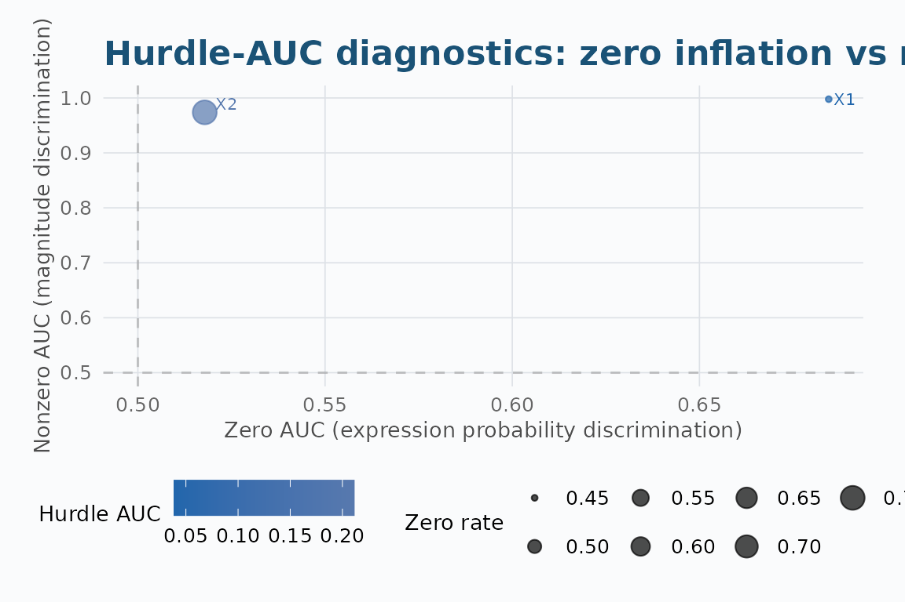
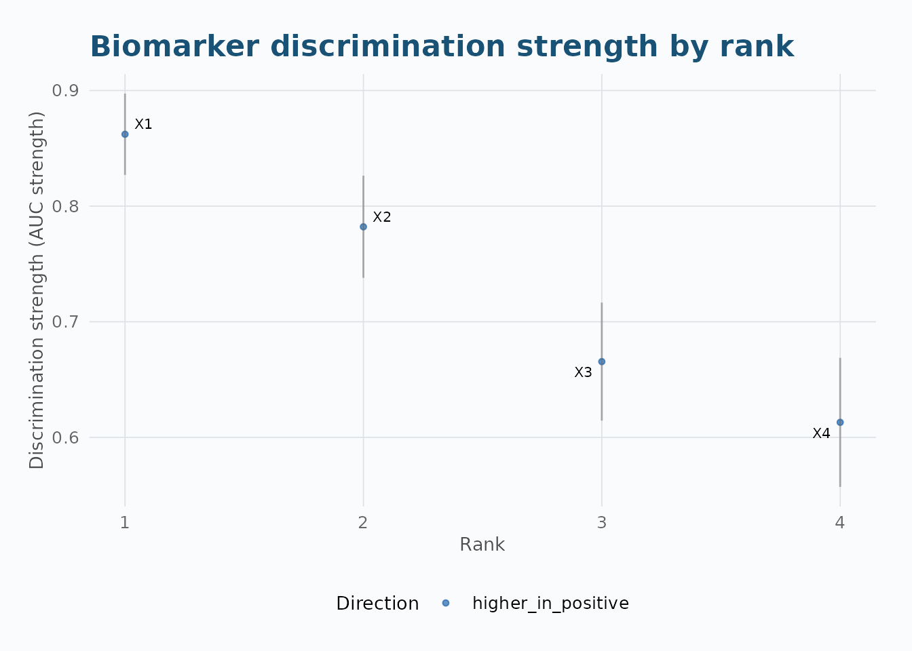
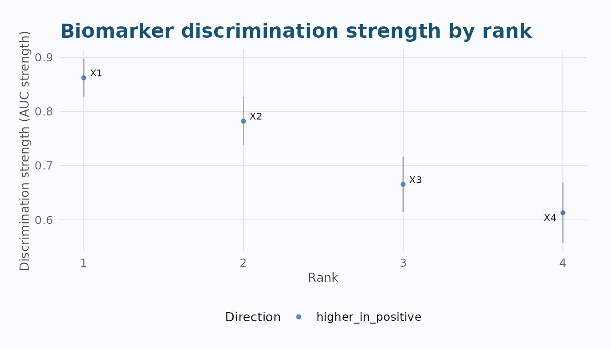
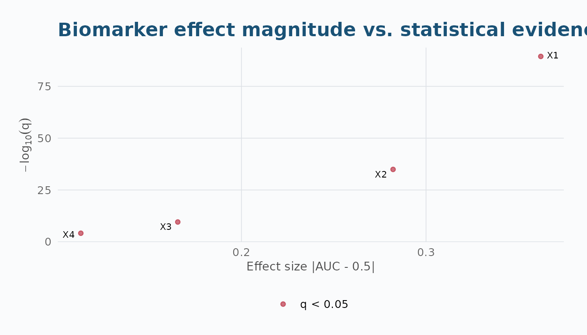
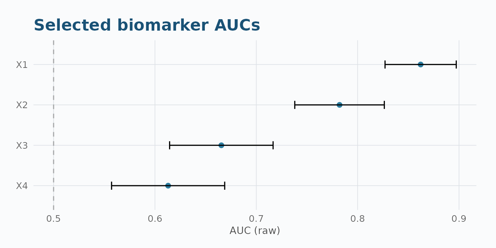
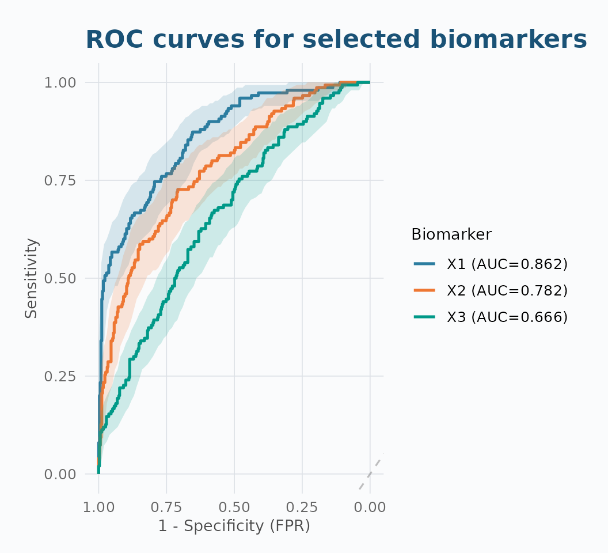
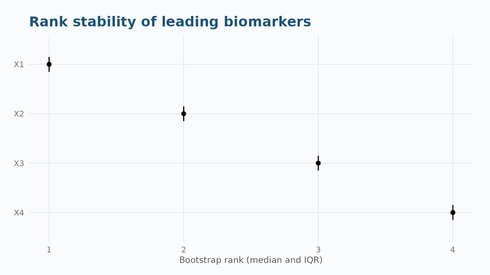
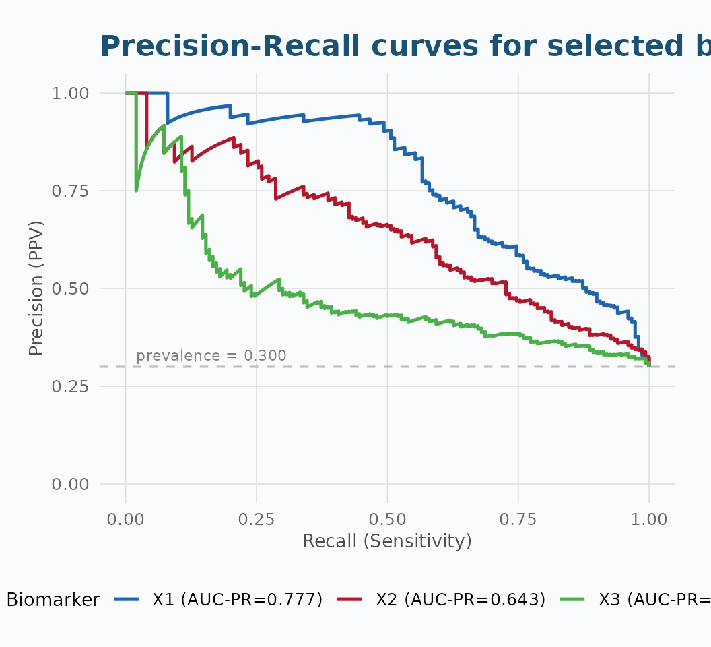
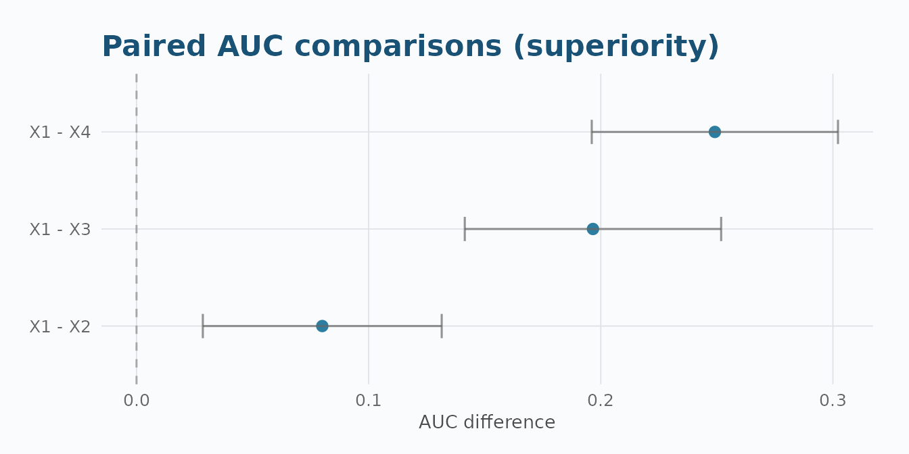

# Introduction to aucmat

``` r

library(aucmat)
```

## Overview

`aucmat` is a matrix-first R package for screening and ranking molecular
biomarkers against binary outcomes. It reports **direction-preserving
AUCs** and provides inference, multiplicity adjustment, paired
comparisons, bootstrap rank stability, and publication-quality
visualizations.

This vignette uses simulated data throughout, to keep the API examples
fast and self-contained. For a worked example on real biomarker data –
Olink plasma proteomics from a randomized clinical trial, including a
real-data negative control and bootstrap validation of the findings –
see the [Real-Data Application: BeatMG
Proteomics](https://vanhungtran.github.io/aucmat/articles/real-data-beatmg.md)
vignette.

### Function Reference

| Category | Function | Description |
|----|----|----|
| **Screening** | [`aucmat()`](https://vanhungtran.github.io/aucmat/reference/aucmat.md) | Screen all biomarkers against a binary outcome |
| **Inference** | [`compare_auc()`](https://vanhungtran.github.io/aucmat/reference/compare_auc.md) | Paired comparisons (superiority, NI, equivalence) |
|  | [`compare_auc_global()`](https://vanhungtran.github.io/aucmat/reference/compare_auc_global.md) | Omnibus Wald test: H0 all AUCs equal |
|  | [`auc_stability()`](https://vanhungtran.github.io/aucmat/reference/auc_stability.md) | Bootstrap rank-stability analysis |
| **Simulation** | [`simulate_auc_matrix()`](https://vanhungtran.github.io/aucmat/reference/simulate_auc_matrix.md) | General-purpose matrix simulator (recommended) |
|  | [`validate_simulation()`](https://vanhungtran.github.io/aucmat/reference/validate_simulation.md) | Repeated-draw calibration check |
|  | [`generate_data_probit()`](https://vanhungtran.github.io/aucmat/reference/generate_data_probit.md) | Latent probit: free AUC + correlation |
|  | [`generate_data_analytical()`](https://vanhungtran.github.io/aucmat/reference/generate_data_analytical.md) | Sequential binormal |
|  | [`generate_auc_vector()`](https://vanhungtran.github.io/aucmat/reference/generate_auc_vector.md) | Single score, exact empirical AUC |
|  | [`generate_auc_cor_vector()`](https://vanhungtran.github.io/aucmat/reference/generate_auc_cor_vector.md) | Single score, exact AUC + approx Pearson r |
|  | [`simulate_auc_correlation()`](https://vanhungtran.github.io/aucmat/reference/simulate_auc_correlation.md) | Monte Carlo (AUC, r) sampling distribution |
| **Visualization** | [`plot_auc_rank()`](https://vanhungtran.github.io/aucmat/reference/plot_auc_rank.md) | Ordered discrimination strengths with CIs |
|  | [`plot_auc_volcano()`](https://vanhungtran.github.io/aucmat/reference/plot_auc_volcano.md) | Effect magnitude vs statistical evidence |
|  | [`plot_auc_forest()`](https://vanhungtran.github.io/aucmat/reference/plot_auc_forest.md) | Selected AUCs with confidence intervals |
|  | [`plot_auc_stability()`](https://vanhungtran.github.io/aucmat/reference/plot_auc_stability.md) | Bootstrap rank distributions |
|  | [`plot_roc_top()`](https://vanhungtran.github.io/aucmat/reference/plot_roc_top.md) | ROC curves for selected biomarkers (CI ribbons by default) |
|  | [`plot_auc_pr()`](https://vanhungtran.github.io/aucmat/reference/plot_auc_pr.md) | Precision-Recall curves for imbalanced data |
| **S3 Methods** | [`print()`](https://rdrr.io/r/base/print.html), [`summary()`](https://rdrr.io/r/base/summary.html), [`as.data.frame()`](https://rdrr.io/r/base/as.data.frame.html), [`plot()`](https://rdrr.io/r/graphics/plot.default.html), [`subset()`](https://rdrr.io/r/base/subset.html) | For `aucmat_screen` objects |
|  | [`plot()`](https://rdrr.io/r/graphics/plot.default.html) | Also dispatches on `aucmat_compare` (forest of pairwise differences) |

------------------------------------------------------------------------

## 1. How Data is Simulated

The AUC (Area Under the ROC Curve) answers: *if I pick one positive and
one negative subject at random, how often does the positive have a
higher biomarker value?* An AUC of 0.5 is useless (coin flip); 1.0 is
perfect separation.

### The Binormal Model

Under the equal-variance binormal model, biomarker values are normally
distributed in each class with a shared variance:

X \mid Y = 0 \sim \mathcal{N}(\mu_0, \sigma^2), \qquad X \mid Y = 1 \sim
\mathcal{N}(\mu_1, \sigma^2)

The AUC is linked to the standardized mean separation \delta = (\mu_1 -
\mu_0)/\sigma:

\text{AUC} = \Phi\\\left(\frac{\delta}{\sqrt{2}}\right)

To target a specific AUC, invert: \delta = \sqrt{2} \cdot
\Phi^{-1}(\text{AUC}). For example, AUC = 0.8 requires \delta \approx
1.19 — the positive class mean is about 1.19 standard deviations above
the negative class mean.

### Simulation Approaches

| Function | AUC + Correlation | Approach | Speed |
|----|----|----|----|
| [`simulate_auc_matrix()`](https://vanhungtran.github.io/aucmat/reference/simulate_auc_matrix.md) | **Independent** (named structures) | Class-conditional MVN, closed-form \delta | Fast |
| [`generate_data_probit()`](https://vanhungtran.github.io/aucmat/reference/generate_data_probit.md) | **Independent** (full matrix) | Latent MVN, numerical \rho calibration | Slower |
| [`generate_data_analytical()`](https://vanhungtran.github.io/aucmat/reference/generate_data_analytical.md) | **Linked** (binormal constraint) | Sequential decomposition | Fast |
| [`generate_auc_vector()`](https://vanhungtran.github.io/aucmat/reference/generate_auc_vector.md) | AUC only (exact) | Rank construction | Instant |
| [`generate_auc_cor_vector()`](https://vanhungtran.github.io/aucmat/reference/generate_auc_cor_vector.md) | AUC exact, Pearson r approx | Rank + Box-Cox tuning | Fast |
| [`simulate_auc_correlation()`](https://vanhungtran.github.io/aucmat/reference/simulate_auc_correlation.md) | Sampling distribution | Monte Carlo binormal | Moderate |

------------------------------------------------------------------------

## 2. Simulating Biomarker Data

### 2.1 `simulate_auc_matrix()` — Recommended General-Purpose Simulator

Draws class-conditional multivariate normal biomarkers with a named
correlation structure. The outcome is fixed before any biomarker is
drawn.

``` r

set.seed(42)
sim <- simulate_auc_matrix(
  n = 500, prevalence = 0.3,
  target_aucs = c(0.90, 0.80, 0.70, 0.65),
  correlation = 0.3, structure = "exchangeable"
)
data.frame(Target = sim$target_aucs, Achieved = round(sim$achieved_aucs, 4))
#>    Target Achieved
#> X1   0.90   0.8622
#> X2   0.80   0.7821
#> X3   0.70   0.6655
#> X4   0.65   0.6130
```

#### Correlation Structures

``` r

# Exchangeable: all off-diagonal entries equal
sim_ex <- simulate_auc_matrix(
  n = 500, prevalence = 0.3,
  target_aucs = c(0.9, 0.8, 0.7, 0.65),
  correlation = 0.4, structure = "exchangeable", seed = 1
)

# AR(1): correlation decays with distance |i-j|
sim_ar1 <- simulate_auc_matrix(
  n = 500, prevalence = 0.3,
  target_aucs = c(0.9, 0.8, 0.7, 0.65),
  correlation = 0.6, structure = "ar1", seed = 1
)

# Block: within-block and between-block correlations
sim_blk <- simulate_auc_matrix(
  n = 500, prevalence = 0.3,
  target_aucs = c(0.9, 0.8, 0.7, 0.65),
  structure = "block", block_sizes = c(2, 2),
  rho_within = 0.6, rho_between = 0.1, seed = 1
)

cat("Exchangeable:\n")
#> Exchangeable:
round(sim_ex$achieved_correlation, 3)
#>       X1    X2    X3    X4
#> X1 1.000 0.366 0.323 0.366
#> X2 0.366 1.000 0.390 0.423
#> X3 0.323 0.390 1.000 0.350
#> X4 0.366 0.423 0.350 1.000
cat("\nAR(1):\n")
#> 
#> AR(1):
round(sim_ar1$achieved_correlation, 3)
#>       X1    X2    X3    X4
#> X1 1.000 0.563 0.281 0.176
#> X2 0.563 1.000 0.593 0.375
#> X3 0.281 0.593 1.000 0.572
#> X4 0.176 0.375 0.572 1.000
cat("\nBlock:\n")
#> 
#> Block:
round(sim_blk$achieved_correlation, 3)
#>       X1    X2    X3    X4
#> X1 1.000 0.579 0.026 0.068
#> X2 0.579 1.000 0.088 0.125
#> X3 0.026 0.088 1.000 0.566
#> X4 0.068 0.125 0.566 1.000
```

#### Feasibility Diagnostics

When the requested correlation matrix is not positive definite,
`feasibility = "nearest"` projects to the closest valid matrix:

``` r

sim_adj <- simulate_auc_matrix(
  n = 200, prevalence = 0.3,
  target_aucs = c(0.8, 0.7, 0.6, 0.55),
  correlation = -0.5, structure = "exchangeable",
  feasibility = "nearest", seed = 1
)
sim_adj$feasibility
#> $status
#> [1] "adjusted"
#> 
#> $adjusted
#> [1] TRUE
#> 
#> $min_eigenvalue
#> [1] -0.5
#> 
#> $frobenius_adjustment
#> [1] 0.5773503
#> 
#> $max_abs_adjustment
#> [1] 0.1666667
```

#### Supplied Outcome

When `y` is supplied, its exact values, class counts, and row order are
preserved:

``` r

y_sup <- rbinom(300, 1, 0.3)
sim_y <- simulate_auc_matrix(
  y = y_sup,
  target_aucs = c(0.85, 0.75),
  correlation = 0.3, structure = "exchangeable", seed = 1
)
table(original = y_sup, generated = sim_y$data$truth)
#>         generated
#> original   0   1
#>        0 209   0
#>        1   0  91
```

### 2.2 `validate_simulation()` — Calibration Check

A single draw is not evidence a simulator is calibrated. This function
repeats the spec many times and reports bias, RMSE, Monte Carlo SE, and
target-interval hit rates for both AUCs and correlations.

``` r

val <- validate_simulation(
  n = 300, prevalence = 0.3,
  target_aucs = c(0.85, 0.75, 0.65),
  correlation = 0.3, structure = "exchangeable",
  times = 100, seed = 1
)
print(val)
#> <aucmat_simulation_validation>  100/100 successful replicates
#> 
#> AUC calibration:
#>  biomarker    bias   rmse  mc_se hit_rate
#>         X1 -0.0004 0.0230 0.0023     0.66
#>         X2 -0.0020 0.0290 0.0029     0.43
#>         X3 -0.0047 0.0326 0.0032     0.46
#> 
#> Correlation calibration (upper triangle):
#>   Mean bias:     0.0034
#>   Mean RMSE:     0.0543
#>   Mean hit rate: 0.65
```

A bias large relative to the Monte Carlo SE signals a calibration
problem.

### 2.3 Other Simulators

``` r

set.seed(42)

# Latent probit: independent AUC + correlation
sim_p <- generate_data_probit(
  n = 500,
  target_aucs = c(0.90, 0.80, 0.70, 0.65),
  corr_matrix = matrix(c(
    1.0, 0.4, 0.2, 0.1,
    0.4, 1.0, 0.3, 0.2,
    0.2, 0.3, 1.0, 0.3,
    0.1, 0.2, 0.3, 1.0
  ), 4, 4),
  prevalence = 0.3
)

# Binormal sequential
sim_a <- generate_data_analytical(
  n = 500, prevalence = 0.3,
  target_aucs = c(0.85, 0.75, 0.65),
  corr_matrix = matrix(c(1, 0.3, 0.1, 0.3, 1, 0.2, 0.1, 0.2, 1), 3, 3)
)

# Exact empirical AUC for a single biomarker
y_raw <- rbinom(200, 1, 0.3)
out_auc <- generate_auc_vector(y_raw, target_auc = 0.80)

# Exact AUC + approximate Pearson correlation
out_cor <- generate_auc_cor_vector(y_raw, target_auc = 0.80, target_cor = 0.45)

# Monte Carlo sampling distribution
mc <- simulate_auc_correlation(y_raw, target_auc = c(0.7, 0.8, 0.9),
                                n_sim = 200, seed = 123)

# Compare achieved vs target
cat("=== Latent probit ===\n")
#> === Latent probit ===
data.frame(Target = sim_p$target_aucs, Achieved = round(sim_p$achieved_aucs, 4))
#>   Target Achieved
#> 1   0.90   0.8910
#> 2   0.80   0.7951
#> 3   0.70   0.6776
#> 4   0.65   0.6433

cat("\n=== Binormal sequential ===\n")
#> 
#> === Binormal sequential ===
data.frame(Target = c(0.85, 0.75, 0.65), Achieved = round(sim_a$achieved_aucs, 4))
#>   Target Achieved
#> 1   0.85   0.8556
#> 2   0.75   0.7546
#> 3   0.65   0.6483

cat("\n=== Single AUC vector ===\n")
#> 
#> === Single AUC vector ===
c(Requested = out_auc$requested_auc, Achieved = round(out_auc$achieved_auc, 4))
#> Requested  Achieved 
#>       0.8       0.8

cat("\n=== AUC + correlation vector ===\n")
#> 
#> === AUC + correlation vector ===
c(AUC_req = out_cor$requested_auc, AUC_ach = round(out_cor$achieved_auc, 4),
  Cor_req = out_cor$requested_cor, Cor_ach = round(out_cor$achieved_cor, 4))
#> AUC_req AUC_ach Cor_req Cor_ach 
#>    0.80    0.80    0.45    0.45

cat("\n=== Monte Carlo (mean achieved AUC by target) ===\n")
#> 
#> === Monte Carlo (mean achieved AUC by target) ===
aggregate(auc ~ target_auc, data = mc$results, mean)
#>   target_auc       auc
#> 1        0.7 0.7012948
#> 2        0.8 0.7988312
#> 3        0.9 0.9037948
```

### 2.4 `simulate_auc_copula()` — Gaussian Copula + Perturbation

The copula simulator separates correlation structure (Phase 1: Gaussian
copula) from discriminative signal (Phase 2: iterative AUC
perturbation), achieving both accurate correlations and accurate AUCs
without the tradeoffs of the binormal model.

``` r

sim_cop <- simulate_auc_copula(
  n = 300, prevalence = 0.3,
  target_aucs = c(0.85, 0.75, 0.65),
  corr_matrix = matrix(c(1, 0.4, 0.2, 0.4, 1, 0.3, 0.2, 0.3, 1), 3, 3),
  seed = 1
)
data.frame(
  Target   = sim_cop$target_aucs,
  Phase1   = round(sim_cop$phase1_aucs, 3),
  Achieved = round(sim_cop$achieved_aucs, 3)
)
#>    Target Phase1 Achieved
#> X1   0.85  0.855    0.855
#> X2   0.75  0.754    0.754
#> X3   0.65  0.652    0.652
```

### 2.5 Hurdle-AUC for Zero-Inflated Data

scRNA-seq, microbiome, and detection-limited assays produce data where
60%+ of values are exactly zero. Standard AUC is near 0.5 on such data
because the binormal assumption breaks.
[`hurdle_auc()`](https://vanhungtran.github.io/aucmat/reference/hurdle_auc.md)
uses a two-stage model:

1.  **Zero hurdle:** P(X=0 \| class) via logistic regression
2.  **Magnitude:** standard AUC on nonzero values only

``` r

sim_hur <- simulate_hurdle_auc(
  n = 400, prevalence = 0.3,
  target_hurdle_aucs = c(0.85, 0.72),
  zero_rate_neg = c(0.55, 0.80),
  zero_rate_pos = c(0.25, 0.70), seed = 1
)
Xh <- as.matrix(sim_hur$data[, 1:2])
yh <- sim_hur$data$truth

# Standard AUC vs Hurdle AUC
fit_std <- aucmat(Xh, yh, ci = "none")
fit_hur <- hurdle_auc(Xh, yh)

data.frame(
  Biomarker     = paste0("X", 1:2),
  Standard_AUC  = round(fit_std$results$auc_strength, 3),
  Hurdle_AUC    = round(fit_hur$results$hurdle_auc, 3),
  Zero_AUC      = round(fit_hur$results$zero_auc, 3),
  Nonzero_AUC   = round(fit_hur$results$nonzero_auc, 3)
)
#>   Biomarker Standard_AUC Hurdle_AUC Zero_AUC Nonzero_AUC
#> 1        X1        0.861      0.039    0.685       0.998
#> 2        X2        0.549      0.211    0.518       0.974
```

``` r

plot_hurdle_diagnostics(fit_hur)
```



------------------------------------------------------------------------

## 3. Matrix Screening: `aucmat()`

[`aucmat()`](https://vanhungtran.github.io/aucmat/reference/aucmat.md)
screens every biomarker column against a binary outcome with
direction-preserving AUCs and configurable inference.

``` r

X <- as.matrix(sim$data[, 1:4])
y <- sim$data$truth

fit <- aucmat(X, y, ci = "delong", adjust = "BH")
print(fit)
#> <aucmat_screen>  4 biomarkers
#>   Outcome: 150 positive / 350 negative  (positive = pos)
#>   CI: delong  |  adjust: BH  |  na_action: featurewise
#> 
#> Top biomarkers by discrimination strength:
#>  rank biomarker   auc_raw auc_strength   effect_direction      p_value
#>     1        X1 0.8621524    0.8621524 higher_in_positive 9.539568e-91
#>     2        X2 0.7821333    0.7821333 higher_in_positive 5.983288e-36
#>     3        X3 0.6655238    0.6655238 higher_in_positive 2.084701e-10
#>     4        X4 0.6130095    0.6130095 higher_in_positive 7.219263e-05
#>       q_value status
#>  3.815827e-90     ok
#>  1.196658e-35     ok
#>  2.779602e-10     ok
#>  7.219263e-05     ok
```

``` r

summary(fit)
#> aucmat screening summary
#> ========================
#> Total samples:       500 
#> Usable samples:      500 
#> Excluded (NA y):     0 
#> Positive class:     pos (n = 150)
#> Negative class:     neg (n = 350)
#> 
#> Biomarkers screened: 4 
#> Status counts:
#> 
#> ok 
#>  4 
#> 
#> Missingness:
#>   Mean missing fraction:  0 
#>   Max  missing fraction:  0 
#>   Fully observed:         4  biomarkers
#> 
#> Multiplicity (BH):
#>   q < 0.05:  4  biomarkers
#>   q < 0.01:  4  biomarkers
```

### Result Columns

| Column | Description |
|----|----|
| `biomarker` | Column name from X |
| `auc_raw` | AUC on observed direction (may be \< 0.5) |
| `auc_strength` | 0.5 + \|\text{auc\\raw} - 0.5\| — always ≥ 0.5 |
| `effect_direction` | `higher_in_positive` or `lower_in_positive` |
| `std_error` | DeLong or bootstrap standard error |
| `conf_low`, `conf_high` | Confidence interval bounds |
| `p_value`, `q_value` | Raw and multiplicity-adjusted p-values |
| `rank` | Ordered by `auc_strength` descending |
| `n_used`, `n_pos`, `n_neg` | Sample counts per biomarker |
| `n_missing`, `missing_fraction` | Missing data diagnostics |
| `status` | `ok`, `constant`, `insufficient_positive`, etc. |
| `warning` | `small_class_counts`, `high_missingness`, etc. |

### Configuration Options

``` r

# DeLong CIs with Benjamini-Hochberg adjustment (default)
fit_delong <- aucmat(X, y, ci = "delong", adjust = "BH")

# Stratified bootstrap CIs
fit_boot   <- aucmat(X, y, ci = "bootstrap", boot_n = 2000, seed = 42)

# No inference (fastest — AUC only, no CIs or p-values)
fit_none   <- aucmat(X, y, ci = "none")

# Bonferroni adjustment (stricter than BH)
fit_bonf   <- aucmat(X, y, ci = "delong", adjust = "bonferroni")

# Complete-case analysis (remove rows with any NA)
fit_comp   <- aucmat(X, y, ci = "delong", na_action = "complete")

# Retain data for downstream plotting without supplying X, y again
fit_keep   <- aucmat(X, y, ci = "delong", retain_data = TRUE)
```

### S3 Methods for `aucmat_screen`

``` r

print(fit)                          # compact top-10 display
#> <aucmat_screen>  4 biomarkers
#>   Outcome: 150 positive / 350 negative  (positive = pos)
#>   CI: delong  |  adjust: BH  |  na_action: featurewise
#> 
#> Top biomarkers by discrimination strength:
#>  rank biomarker   auc_raw auc_strength   effect_direction      p_value
#>     1        X1 0.8621524    0.8621524 higher_in_positive 9.539568e-91
#>     2        X2 0.7821333    0.7821333 higher_in_positive 5.983288e-36
#>     3        X3 0.6655238    0.6655238 higher_in_positive 2.084701e-10
#>     4        X4 0.6130095    0.6130095 higher_in_positive 7.219263e-05
#>       q_value status
#>  3.815827e-90     ok
#>  1.196658e-35     ok
#>  2.779602e-10     ok
#>  7.219263e-05     ok
summary(fit)                        # counts, statuses, missingness, multiplicity
#> aucmat screening summary
#> ========================
#> Total samples:       500 
#> Usable samples:      500 
#> Excluded (NA y):     0 
#> Positive class:     pos (n = 150)
#> Negative class:     neg (n = 350)
#> 
#> Biomarkers screened: 4 
#> Status counts:
#> 
#> ok 
#>  4 
#> 
#> Missingness:
#>   Mean missing fraction:  0 
#>   Max  missing fraction:  0 
#>   Fully observed:         4  biomarkers
#> 
#> Multiplicity (BH):
#>   q < 0.05:  4  biomarkers
#>   q < 0.01:  4  biomarkers
head(as.data.frame(fit))            # full results as a plain data.frame
#>   biomarker   auc_raw auc_strength   effect_direction n_used n_pos n_neg status
#> 1        X1 0.8621524    0.8621524 higher_in_positive    500   150   350     ok
#> 2        X2 0.7821333    0.7821333 higher_in_positive    500   150   350     ok
#> 3        X3 0.6655238    0.6655238 higher_in_positive    500   150   350     ok
#> 4        X4 0.6130095    0.6130095 higher_in_positive    500   150   350     ok
#>       prauc n_total n_missing missing_fraction  std_error  conf_low conf_high
#> 1 0.7767808     500         0                0 0.01792720 0.8270157 0.8972890
#> 2 0.6426025     500         0                0 0.02253897 0.7379578 0.8263089
#> 3 0.4826565     500         0                0 0.02604636 0.6144739 0.7165737
#> 4 0.4162938     500         0                0 0.02847347 0.5572026 0.6688165
#>        p_value      q_value rank warning
#> 1 9.539568e-91 3.815827e-90    1    <NA>
#> 2 5.983288e-36 1.196658e-35    2    <NA>
#> 3 2.084701e-10 2.779602e-10    3    <NA>
#> 4 7.219263e-05 7.219263e-05    4    <NA>
plot(fit)                           # alias for plot_auc_rank(fit)
```



``` r

subset(fit, q_value < 0.05)         # filter by significance
#>   biomarker   auc_raw auc_strength   effect_direction n_used n_pos n_neg status
#> 1        X1 0.8621524    0.8621524 higher_in_positive    500   150   350     ok
#> 2        X2 0.7821333    0.7821333 higher_in_positive    500   150   350     ok
#> 3        X3 0.6655238    0.6655238 higher_in_positive    500   150   350     ok
#> 4        X4 0.6130095    0.6130095 higher_in_positive    500   150   350     ok
#>       prauc n_total n_missing missing_fraction  std_error  conf_low conf_high
#> 1 0.7767808     500         0                0 0.01792720 0.8270157 0.8972890
#> 2 0.6426025     500         0                0 0.02253897 0.7379578 0.8263089
#> 3 0.4826565     500         0                0 0.02604636 0.6144739 0.7165737
#> 4 0.4162938     500         0                0 0.02847347 0.5572026 0.6688165
#>        p_value      q_value rank warning
#> 1 9.539568e-91 3.815827e-90    1    <NA>
#> 2 5.983288e-36 1.196658e-35    2    <NA>
#> 3 2.084701e-10 2.779602e-10    3    <NA>
#> 4 7.219263e-05 7.219263e-05    4    <NA>
subset(fit, auc_strength > 0.8)     # filter by discrimination strength
#>   biomarker   auc_raw auc_strength   effect_direction n_used n_pos n_neg status
#> 1        X1 0.8621524    0.8621524 higher_in_positive    500   150   350     ok
#>       prauc n_total n_missing missing_fraction std_error  conf_low conf_high
#> 1 0.7767808     500         0                0 0.0179272 0.8270157  0.897289
#>        p_value      q_value rank warning
#> 1 9.539568e-91 3.815827e-90    1    <NA>
```

------------------------------------------------------------------------

## 4. Visualizing Results

Every function returns a `ggplot2` object. Labels are limited to a
configurable number of top features to keep wide-matrix views readable.

### 4.1 Rank Plot — `plot_auc_rank()`

Ordered discrimination strengths with DeLong CI error bars. Colour
indicates effect direction: blue = higher in positives, red = lower.

``` r

plot_auc_rank(fit, n_label = 4)
```



### 4.2 Volcano Plot — `plot_auc_volcano()`

Effect magnitude (\|\text{AUC} - 0.5\|) against statistical evidence
(-\log\_{10} q). Biomarkers with q \< \text{cutoff} are highlighted in
red.

``` r

plot_auc_volcano(fit, q_cutoff = 0.05)
```



### 4.3 Forest Plot — `plot_auc_forest()`

Point estimates with confidence intervals for selected biomarkers.

``` r

plot_auc_forest(fit, n = 4)
```



### 4.4 ROC Curves — `plot_roc_top()`

Empirical ROC curves for deliberately selected biomarkers. Bootstrap CI
ribbons showing estimation uncertainty are on by default
(`add_ci = TRUE`); pass `add_ci = FALSE` to skip them for a faster plot.

``` r

plot_roc_top(fit, X = X, y = y,
  biomarkers = head(fit$results$biomarker, 3))
```



### 4.5 Stability Plot — `plot_auc_stability()`

Bootstrap rank distributions: median (point) and IQR (error bar).

``` r

stab <- auc_stability(X, y, times = 200, top_k = c(3, 5), seed = 42)
plot_auc_stability(stab, n_label = 8)
```



A biomarker with a tight bar near rank 1 is a dependable top candidate;
a wide bar means its ranking is sensitive to which subjects happened to
be sampled – worth caution before committing it to a follow-up study.

### 4.6 Precision-Recall Curves — `plot_auc_pr()`

ROC curves can look deceptively good when positives are rare;
precision-recall curves don’t. Prefer this view whenever prevalence is
well below 0.5.

``` r

plot_auc_pr(X, y, biomarkers = head(fit$results$biomarker, 3))
```



The dashed line marks the prevalence – the precision a random classifier
would achieve. A useful biomarker’s curve sits well above it across most
of the recall range.

------------------------------------------------------------------------

## 5. Comparing Biomarker AUCs: `compare_auc()`

[`compare_auc()`](https://vanhungtran.github.io/aucmat/reference/compare_auc.md)
tests AUC differences between biomarkers measured on the **same
subjects**, supporting three hypothesis types and three selection modes.

### 5.1 Three Comparison Modes

``` r

# Mode 1: Reference — every other biomarker vs one reference
cmp_ref <- compare_auc(fit, X, y, reference = "X1")
print(cmp_ref)
#> <aucmat_compare>  3 pairwise comparisons
#>  biomarker_a biomarker_b     auc_a     auc_b   auc_diff  std_error   conf_low
#>           X1          X2 0.8621524 0.7821333 0.08001905 0.02625104 0.02856795
#>           X1          X3 0.8621524 0.6655238 0.19662857 0.02817393 0.14140869
#>           X1          X4 0.8621524 0.6130095 0.24914286 0.02706024 0.19610576
#>  conf_high      p_value q_value n_common n_pos n_neg  hypothesis margin
#>  0.1314701 2.301985e-03      NA      500   150   350 superiority      0
#>  0.2518485 2.970837e-12      NA      500   150   350 superiority      0
#>  0.3021800 3.354582e-20      NA      500   150   350 superiority      0

# Mode 2: Top-N — all pairs among top N (with post-selection warning)
cmp_top <- compare_auc(fit, X, y, top_n = 3)

# Mode 3: Named set — all pairs within a specific list
cmp_set <- compare_auc(fit, X, y, biomarkers = c("X1", "X2", "X4"))
```

### 5.2 Three Hypothesis Types

``` r

# 1. Superiority (default): H0: AUC_a = AUC_b
cmp_sup <- compare_auc(fit, X, y, reference = "X1",
  hypothesis = "superiority")

# 2. Directional superiority: H0: AUC_a <= AUC_b (a is no better)
cmp_dir <- compare_auc(fit, X, y, reference = "X1",
  hypothesis = "superiority", alternative = "greater")

# 3. Non-inferiority: H0: AUC_a is worse than AUC_b by at least margin
cmp_ni <- compare_auc(fit, X, y, reference = "X1",
  hypothesis = "noninferiority", margin = 0.05)

# 4. Equivalence (TOST): H0_lower: delta <= -m, H0_upper: delta >= m
cmp_eq <- compare_auc(fit, X, y, reference = "X1",
  hypothesis = "equivalence", margin = 0.15)
```

**Output columns:** `biomarker_a`, `biomarker_b`, `auc_a`, `auc_b`,
`auc_diff`, `std_error`, `conf_low`, `conf_high`, `p_value`, `q_value`,
`n_common`, `n_pos`, `n_neg`, `hypothesis`, `margin`.

For equivalence, `p_value = max(p_lower, p_upper)` (TOST) and the
interval is 1 - 2\alpha.

### 5.3 Multiplicity Adjustment

``` r

compare_auc(fit, X, y, top_n = 3, adjust = "BH")
#> <aucmat_compare>  3 pairwise comparisons
#>  biomarker_a biomarker_b     auc_a     auc_b   auc_diff  std_error   conf_low
#>           X1          X2 0.8621524 0.7821333 0.08001905 0.02625104 0.02856795
#>           X1          X3 0.8621524 0.6655238 0.19662857 0.02817393 0.14140869
#>           X2          X3 0.7821333 0.6655238 0.11660952 0.02933813 0.05910785
#>  conf_high      p_value      q_value n_common n_pos n_neg  hypothesis margin
#>  0.1314701 2.301985e-03 2.301985e-03      500   150   350 superiority      0
#>  0.2518485 2.970837e-12 8.912512e-12      500   150   350 superiority      0
#>  0.1741112 7.047548e-05 1.057132e-04      500   150   350 superiority      0
compare_auc(fit, X, y, reference = "X1", adjust = "holm")
#> <aucmat_compare>  3 pairwise comparisons
#>  biomarker_a biomarker_b     auc_a     auc_b   auc_diff  std_error   conf_low
#>           X1          X2 0.8621524 0.7821333 0.08001905 0.02625104 0.02856795
#>           X1          X3 0.8621524 0.6655238 0.19662857 0.02817393 0.14140869
#>           X1          X4 0.8621524 0.6130095 0.24914286 0.02706024 0.19610576
#>  conf_high      p_value      q_value n_common n_pos n_neg  hypothesis margin
#>  0.1314701 2.301985e-03 2.301985e-03      500   150   350 superiority      0
#>  0.2518485 2.970837e-12 5.941675e-12      500   150   350 superiority      0
#>  0.3021800 3.354582e-20 1.006375e-19      500   150   350 superiority      0
compare_auc(fit, X, y, biomarkers = c("X1", "X2", "X4"),
  adjust = "bonferroni")
#> <aucmat_compare>  3 pairwise comparisons
#>  biomarker_a biomarker_b     auc_a     auc_b   auc_diff  std_error   conf_low
#>           X1          X2 0.8621524 0.7821333 0.08001905 0.02625104 0.02856795
#>           X1          X4 0.8621524 0.6130095 0.24914286 0.02706024 0.19610576
#>           X2          X4 0.7821333 0.6130095 0.16912381 0.02958582 0.11113667
#>  conf_high      p_value      q_value n_common n_pos n_neg  hypothesis margin
#>  0.1314701 2.301985e-03 6.905956e-03      500   150   350 superiority      0
#>  0.3021800 3.354582e-20 1.006375e-19      500   150   350 superiority      0
#>  0.2271109 1.088164e-08 3.264493e-08      500   150   350 superiority      0
```

### 5.4 Visualizing Comparisons

[`compare_auc()`](https://vanhungtran.github.io/aucmat/reference/compare_auc.md)’s
result has its own
[`plot()`](https://rdrr.io/r/graphics/plot.default.html) method:

``` r

plot(cmp_ref)
```



Each row is one pairwise `auc_diff` (reference minus the other
biomarker) with its CI. The dashed line at 0 is “no difference” – a CI
that doesn’t cross it is a statistically supported difference at the
chosen `alternative`/`hypothesis`.

------------------------------------------------------------------------

## 6. Global Test: `compare_auc_global()`

Tests H_0: \text{AUC}\_1 = \text{AUC}\_2 = \dots = \text{AUC}\_p on a
common subject set using the joint DeLong covariance matrix and a Wald
statistic.

``` r

sim_big <- simulate_auc_matrix(n = 500, prevalence = 0.3,
  target_aucs = c(0.85, 0.80, 0.75, 0.70, 0.65),
  correlation = 0.3, structure = "exchangeable", seed = 3)
X_big <- as.matrix(sim_big$data[, 1:5])
y_big <- sim_big$data$truth
fit_big <- aucmat(X_big, y_big, ci = "delong", adjust = "BH")

global_test <- compare_auc_global(fit_big, X_big, y_big)
print(global_test)
#> <aucmat_global_test>
#>   H0: all AUCs equal
#>   n =500 (150+ / 350-)
#>   Wald chi2(4) = 81.859, p = 0.0000
#> 
#> AUC estimates:
#>     X1     X2     X3     X4     X5 
#> 0.8821 0.7907 0.7734 0.6963 0.6946

# Select specific biomarkers
compare_auc_global(fit_big, X_big, y_big,
  biomarkers = c("X1", "X2", "X3"))
#> <aucmat_global_test>
#>   H0: all AUCs equal
#>   n =500 (150+ / 350-)
#>   Wald chi2(2) = 27.251, p = 0.0000
#> 
#> AUC estimates:
#>     X1     X2     X3 
#> 0.8821 0.7907 0.7734
```

With two biomarkers, the global Wald statistic equals the squared
paired-DeLong z statistic (within numerical tolerance). The default
safety limit is 100 biomarkers; raise it with `max_biomarkers`.

------------------------------------------------------------------------

## 7. Rank Stability: `auc_stability()`

Bootstrap resampling quantifies how much rankings change under sampling
variability, complementing point estimates with distribution
information.

``` r

stab <- auc_stability(X, y, times = 500, top_k = c(10, 25), seed = 42)
print(stab)
#> <aucmat_stability>  500/500 successful replicates
#> Top biomarkers by median rank:
#>  biomarker rank_median rank_q25 rank_q75  auc_mean     auc_sd top1_freq
#>         X1           1        1        1 0.8633750 0.01772095         1
#>         X2           2        2        2 0.7807096 0.02218810         0
#>         X3           3        3        3 0.6644458 0.02578359         0
#>         X4           4        4        4 0.6136745 0.02850398         0

# Rank distribution summary
head(stab$rank_summary)
#>   biomarker rank_median rank_q25 rank_q75  auc_mean     auc_sd top1_freq
#> 1        X1           1        1        1 0.8633750 0.01772095         1
#> 2        X2           2        2        2 0.7807096 0.02218810         0
#> 3        X3           3        3        3 0.6644458 0.02578359         0
#> 4        X4           4        4        4 0.6136745 0.02850398         0

# Top-10 selection probability for each biomarker
head(stab$top_k_probs[stab$top_k_probs$k == 10, ])
#> [1] biomarker k         prob     
#> <0 rows> (or 0-length row.names)

# Pairwise co-selection frequencies for top biomarkers
stab$coselection$biomarkers[1:4]
#> [1] "X1" "X2" "X3" "X4"
```

------------------------------------------------------------------------

## 8. Handling Missing Data

Two strategies via `na_action`:

| `na_action` | Behaviour |
|----|----|
| `"featurewise"` (default) | Each biomarker uses all subjects with observed values — maximises data |
| `"complete"` | Only subjects with complete observations across all biomarkers — comparable populations |

``` r

X_na <- X
X_na[sample(length(X_na), 50)] <- NA

fit_fw <- aucmat(X_na, y, ci = "none", na_action = "featurewise")
head(fit_fw$results[, c("biomarker", "n_used", "n_missing", "missing_fraction")])
#>   biomarker n_used n_missing missing_fraction
#> 1        X1    490        10            0.020
#> 2        X2    487        13            0.026
#> 3        X3    483        17            0.034
#> 4        X4    490        10            0.020
```

Imputation should be done **before** calling
[`aucmat()`](https://vanhungtran.github.io/aucmat/reference/aucmat.md).
The package reports missingness per biomarker and warns on high missing
fractions (\> 50%).

------------------------------------------------------------------------

## 9. Reproducibility

All functions with randomness accept a `seed` argument. When `seed` is
provided, the global `.Random.seed` is restored on exit — including when
an error occurs:

``` r

fit1 <- aucmat(X, y, ci = "bootstrap", boot_n = 500, seed = 123)
fit2 <- aucmat(X, y, ci = "bootstrap", boot_n = 500, seed = 123)
identical(fit1$results$auc_raw, fit2$results$auc_raw)
#> [1] TRUE
```

------------------------------------------------------------------------

## Getting Help

``` r

?aucmat
?simulate_auc_matrix
?validate_simulation
?generate_data_probit
?compare_auc
?compare_auc_global
?auc_stability
?plot_auc_rank
```

See also the [Simulating Biomarker
Data](https://vanhungtran.github.io/aucmat/articles/simulating-biomarker-data.md)
vignette for mathematical foundations of each simulation engine.
