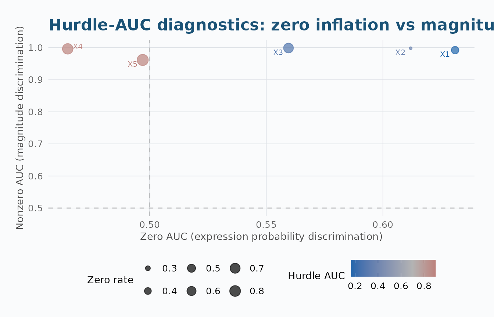
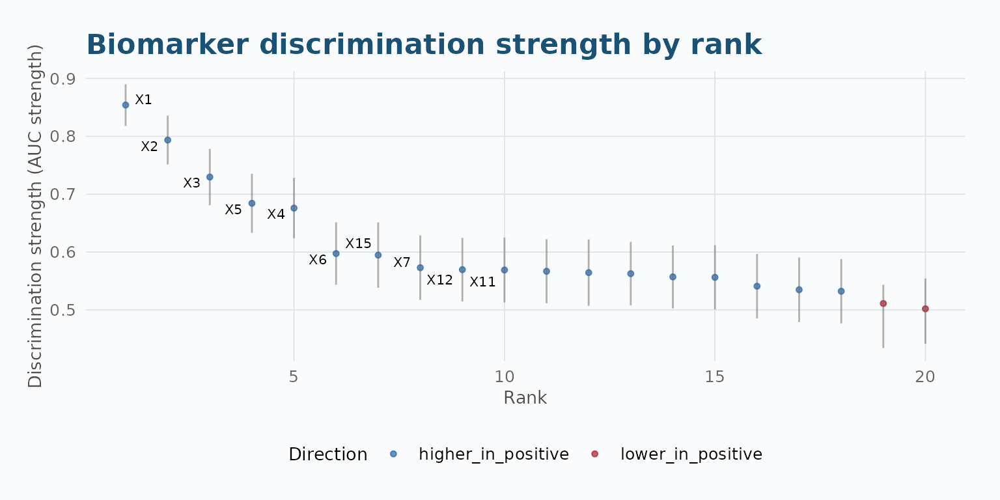
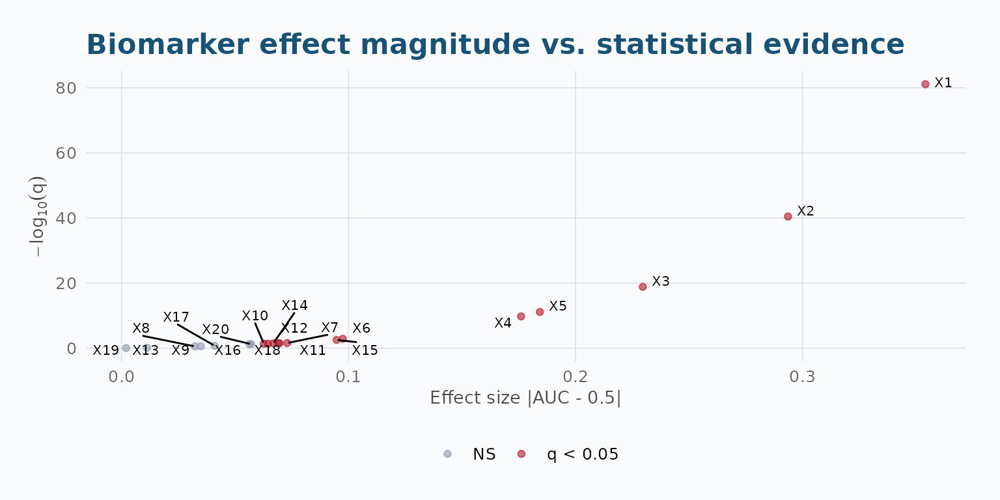
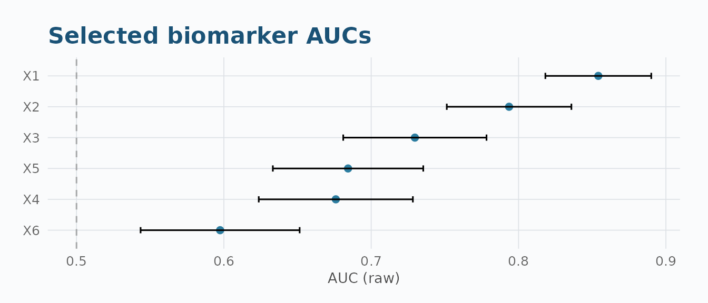
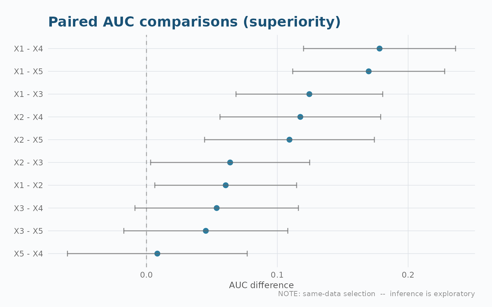
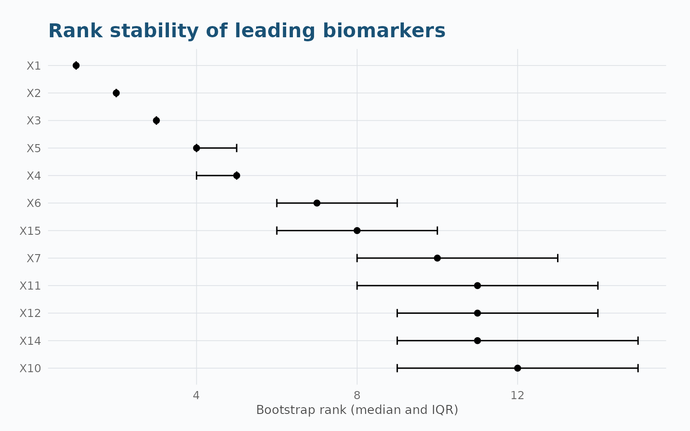
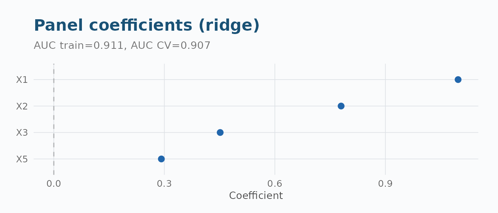
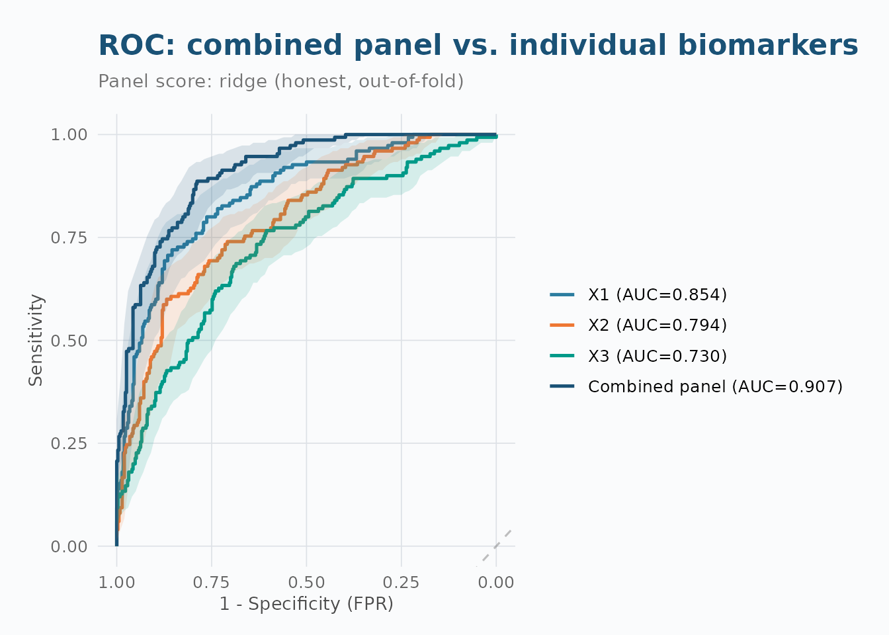

# Practical Biomarker Screening with aucmat

``` r

library(aucmat)
```

## Overview

This vignette walks through a realistic biomarker screening analysis
using `aucmat`, from simulation through to reporting. We follow a
typical omics workflow: generate data with known properties, screen
biomarkers, compare leading candidates, validate via cross-validation,
combine into a panel, and assess power for a follow-up study.

------------------------------------------------------------------------

## 1. Simulate Realistic Biomarker Data

We simulate 500 subjects (30% cases) with 20 biomarkers. The first 5
have moderate-to-strong signals (AUC 0.65–0.85); the remaining 15 are
noise (AUC 0.50–0.55). Biomarkers within functional groups are
correlated.

``` r

set.seed(42)
n_biomarkers <- 20
signal_aucs <- c(0.85, 0.78, 0.72, 0.68, 0.65)
noise_aucs <- runif(15, 0.50, 0.55)
target_aucs <- c(signal_aucs, noise_aucs)

sim <- simulate_auc_matrix(
  n = 500, prevalence = 0.3,
  target_aucs = target_aucs,
  correlation = 0.15, structure = "exchangeable",
  seed = 42
)

X <- as.matrix(sim$data[, 1:20])
y <- sim$data$truth
```

------------------------------------------------------------------------

## 2. Screen All Biomarkers

``` r

fit <- aucmat(X, y, ci = "delong", adjust = "BH")
summary(fit)
#> aucmat screening summary
#> ========================
#> Total samples:       500 
#> Usable samples:      500 
#> Excluded (NA y):     0 
#> Positive class:     pos (n = 150)
#> Negative class:     neg (n = 350)
#> 
#> Biomarkers screened: 20 
#> Status counts:
#> 
#> ok 
#> 20 
#> 
#> Missingness:
#>   Mean missing fraction:  0 
#>   Max  missing fraction:  0 
#>   Fully observed:         20  biomarkers
#> 
#> Multiplicity (BH):
#>   q < 0.05:  13  biomarkers
#>   q < 0.01:  7  biomarkers
```

### Top biomarkers

``` r

head(as.data.frame(fit), 8)
#>   biomarker   auc_raw auc_strength   effect_direction n_used n_pos n_neg status
#> 1        X1 0.8541333    0.8541333 higher_in_positive    500   150   350     ok
#> 2        X2 0.7935810    0.7935810 higher_in_positive    500   150   350     ok
#> 3        X3 0.7296381    0.7296381 higher_in_positive    500   150   350     ok
#> 4        X5 0.6842857    0.6842857 higher_in_positive    500   150   350     ok
#> 5        X4 0.6759810    0.6759810 higher_in_positive    500   150   350     ok
#> 6        X6 0.5974667    0.5974667 higher_in_positive    500   150   350     ok
#> 7       X15 0.5947238    0.5947238 higher_in_positive    500   150   350     ok
#> 8        X7 0.5730095    0.5730095 higher_in_positive    500   150   350     ok
#>       prauc n_total n_missing missing_fraction  std_error  conf_low conf_high
#> 1 0.7285218     500         0                0 0.01833443 0.8181985 0.8900682
#> 2 0.6365104     500         0                0 0.02157401 0.7512967 0.8358652
#> 3 0.5686258     500         0                0 0.02480883 0.6810137 0.7782625
#> 4 0.4889319     500         0                0 0.02604235 0.6332436 0.7353278
#> 5 0.4921055     500         0                0 0.02668300 0.6236832 0.7282787
#> 6 0.3720100     500         0                0 0.02753701 0.5434951 0.6514382
#> 7 0.3986764     500         0                0 0.02883744 0.5382035 0.6512442
#> 8 0.3761586     500         0                0 0.02847128 0.5172068 0.6288122
#>        p_value      q_value rank warning
#> 1 4.001513e-83 8.003025e-82    1    <NA>
#> 2 3.585051e-42 3.585051e-41    2    <NA>
#> 3 2.116290e-20 1.410860e-19    3    <NA>
#> 4 1.479637e-12 7.398183e-12    4    <NA>
#> 5 4.245522e-11 1.698209e-10    5    <NA>
#> 6 4.009184e-04 1.336395e-03    6    <NA>
#> 7 1.020727e-03 2.916363e-03    7    <NA>
#> 8 1.033777e-02 2.584443e-02    8    <NA>
```

------------------------------------------------------------------------

## 3. Hurdle-AUC for Zero-Inflated Biomarkers

Now let’s add zero-inflation to simulate scRNA-seq-like data and compare
standard AUC against the two-stage Hurdle-AUC.

``` r

set.seed(123)
sim_hur <- simulate_hurdle_auc(
  n = 400, prevalence = 0.3,
  target_hurdle_aucs = c(0.85, 0.72, 0.60, 0.55, 0.52),
  zero_rate_neg = c(0.55, 0.30, 0.70, 0.80, 0.90),
  zero_rate_pos = c(0.25, 0.10, 0.60, 0.75, 0.88)
)
Xh <- as.matrix(sim_hur$data[, 1:5])
yh <- sim_hur$data$truth

# Standard AUC
fit_std <- aucmat(Xh, yh, ci = "none")

# Hurdle AUC
fit_hur <- hurdle_auc(Xh, yh)
```

``` r

# Side-by-side comparison
comp <- data.frame(
  Biomarker     = paste0("X", 1:5),
  Standard_AUC  = round(fit_std$results$auc_strength, 3),
  Hurdle_AUC    = round(fit_hur$results$hurdle_auc, 3),
  Zero_AUC      = round(fit_hur$results$zero_auc, 3),
  Nonzero_AUC   = round(fit_hur$results$nonzero_auc, 3),
  Zero_Rate     = round(fit_hur$results$zero_rate_total, 3)
)
comp$Improvement <- round((comp$Hurdle_AUC - comp$Standard_AUC) / comp$Standard_AUC * 100, 1)
comp
#>   Biomarker Standard_AUC Hurdle_AUC Zero_AUC Nonzero_AUC Zero_Rate Improvement
#> 1        X1        0.909      0.166    0.631       0.992     0.450       -81.7
#> 2        X2        0.801      0.377    0.612       0.998     0.265       -52.9
#> 3        X3        0.618      0.287    0.560       0.999     0.675       -53.6
#> 4        X4        0.512      0.900    0.465       0.996     0.767        75.8
#> 5        X5        0.506      0.899    0.497       0.962     0.863        77.7
```

``` r

plot_hurdle_diagnostics(fit_hur)
```



The Hurdle-AUC decomposes discrimination into zero-inflation signal and
magnitude signal, recovering AUCs that standard screening misses on
zero-heavy biomarkers.

------------------------------------------------------------------------

## 4. Visualize Results

### Rank plot

``` r

plot_auc_rank(fit, n_label = 10)
```



### Volcano plot

``` r

plot_auc_volcano(fit, q_cutoff = 0.05)
```



### Forest plot of top biomarkers

``` r

plot_auc_forest(fit, n = 6)
```



------------------------------------------------------------------------

## 5. Compare Leading Candidates

``` r

# All pairs among the top 5
cmp <- compare_auc(fit, X, y, top_n = 5, adjust = "BH")
print(cmp)
#> <aucmat_compare>  10 pairwise comparisons
#>  biomarker_a biomarker_b     auc_a     auc_b    auc_diff  std_error
#>           X1          X2 0.8541333 0.7935810 0.060552381 0.02764886
#>           X1          X3 0.8541333 0.7296381 0.124495238 0.02860600
#>           X1          X5 0.8541333 0.6842857 0.169847619 0.02963004
#>           X1          X4 0.8541333 0.6759810 0.178152381 0.02964190
#>           X2          X3 0.7935810 0.7296381 0.063942857 0.03101015
#>           X2          X5 0.7935810 0.6842857 0.109295238 0.03310608
#>           X2          X4 0.7935810 0.6759810 0.117600000 0.03133155
#>           X3          X5 0.7296381 0.6842857 0.045352381 0.03197302
#>           X3          X4 0.7296381 0.6759810 0.053657143 0.03187017
#>           X5          X4 0.6842857 0.6759810 0.008304762 0.03505457
#>      conf_low  conf_high      p_value      q_value n_common n_pos n_neg
#>   0.006361611 0.11474315 2.852062e-02 4.753437e-02      500   150   350
#>   0.068428502 0.18056197 1.348601e-05 4.495337e-05      500   150   350
#>   0.111773810 0.22792143 9.909070e-09 4.954535e-08      500   150   350
#>   0.120055330 0.23624943 1.853467e-09 1.853467e-08      500   150   350
#>   0.003164085 0.12472163 3.920794e-02 5.601135e-02      500   150   350
#>   0.044408513 0.17418196 9.621581e-04 1.924316e-03      500   150   350
#>   0.056191284 0.17900872 1.744489e-04 4.361221e-04      500   150   350
#>  -0.017313595 0.10801836 1.560572e-01 1.733969e-01      500   150   350
#>  -0.008807237 0.11612152 9.225579e-02 1.153197e-01      500   150   350
#>  -0.060400936 0.07701046 8.127270e-01 8.127270e-01      500   150   350
#>   hypothesis margin
#>  superiority      0
#>  superiority      0
#>  superiority      0
#>  superiority      0
#>  superiority      0
#>  superiority      0
#>  superiority      0
#>  superiority      0
#>  superiority      0
#>  superiority      0
```

### Forest plot of pairwise differences

``` r

plot(cmp)
```



### Global test

``` r

compare_auc_global(fit, X, y, biomarkers = head(fit$results$biomarker, 5))
#> <aucmat_global_test>
#>   H0: all AUCs equal
#>   n =500 (150+ / 350-)
#>   Wald chi2(4) = 56.102, p = 0.0000
#> 
#> AUC estimates:
#>     X1     X2     X3     X5     X4 
#> 0.8541 0.7936 0.7296 0.6843 0.6760
```

------------------------------------------------------------------------

## 6. Assess Rank Stability

``` r

stab <- auc_stability(X, y, times = 500, seed = 123)
print(stab)
#> <aucmat_stability>  500/500 successful replicates
#> Top biomarkers by median rank:
#>  biomarker rank_median rank_q25 rank_q75  auc_mean     auc_sd top1_freq
#>         X1           1        1        1 0.8542072 0.01906443     0.982
#>         X2           2        2        2 0.7938605 0.02001264     0.018
#>         X3           3        3        3 0.7288992 0.02396751     0.000
#>         X5           4        4        5 0.6830487 0.02654496     0.000
#>         X4           5        4        5 0.6747276 0.02747883     0.000
#>         X6           7        6        9 0.5968973 0.02779127     0.000
#>        X15           8        6       10 0.5930889 0.02896229     0.000
#>         X7          10        8       13 0.5730335 0.02996219     0.000
#>        X11          11        8       14 0.5703043 0.02905593     0.000
#>        X12          11        9       14 0.5687912 0.02600102     0.000
```

``` r

plot_auc_stability(stab, n_label = 12)
```



------------------------------------------------------------------------

## 7. Cross-Validated Screening

Same-data AUCs are optimistically biased. Cross-validation gives honest
out-of-fold estimates:

``` r

cv <- cv_aucmat(X, y, n_folds = 5, seed = 123)
print(cv)
#> <aucmat_cv>  20 biomarkers
#>   CV: 5-fold
#>   Mean optimism:  0 
#> 
#> Top biomarkers by CV AUC:
#>  rank_cv biomarker    auc_cv auc_in_sample optimism
#>        1        X1 0.8541333     0.8541333        0
#>        2        X2 0.7935810     0.7935810        0
#>        3        X3 0.7296381     0.7296381        0
#>        4        X5 0.6842857     0.6842857        0
#>        5        X4 0.6759810     0.6759810        0
#>        6        X6 0.5974667     0.5974667        0
#>        7       X15 0.5947238     0.5947238        0
#>        8        X7 0.5730095     0.5730095        0
#>        9       X12 0.5696190     0.5696190        0
#>       10       X11 0.5690286     0.5690286        0

# Compare: in-sample vs CV
head(data.frame(
  biomarker = cv$results$biomarker,
  auc_in_sample = round(cv$results$auc_in_sample, 3),
  auc_cv = round(cv$results$auc_cv, 3),
  optimism = round(cv$results$optimism, 3)
), 8)
#>   biomarker auc_in_sample auc_cv optimism
#> 1        X1         0.854  0.854        0
#> 2        X2         0.794  0.794        0
#> 3        X3         0.730  0.730        0
#> 4        X5         0.684  0.684        0
#> 5        X4         0.676  0.676        0
#> 6        X6         0.597  0.597        0
#> 7       X15         0.595  0.595        0
#> 8        X7         0.573  0.573        0
```

------------------------------------------------------------------------

## 8. Build a Multivariable Panel

Combine the top biomarkers into a single score.
[`fit_auc_panel()`](https://vanhungtran.github.io/aucmat/reference/fit_auc_panel.md)
reports both an in-sample AUC and an **honest, nested** cross-validated
AUC: penalty selection and centering/scaling are re-derived from each
fold’s training portion alone, so the held-out fold never leaks into the
model evaluated on it.

``` r

# Select top 4 biomarkers by CV AUC
top4 <- head(cv$results$biomarker, 4)
X_panel <- X[, top4, drop = FALSE]

panel <- fit_auc_panel(X_panel, y, method = "ridge", n_folds = 5, seed = 123)
print(panel)
#> <aucmat_panel>  ridge
#>   AUC (training): 0.9108
#>   AUC (CV):       0.9074
#>   Optimism:       0.0034
#> 
#> Coefficients:
#>     X1     X2     X3     X5 
#> 1.0974 0.7799 0.4516 0.2919
```

``` r

plot(panel)
```



### 8.1 Other combination methods

Ridge is one of six options. `"su_liu"` is a closed-form linear
combination that maximizes AUC under the multivariate-normal (binormal)
model – fast, no `glmnet` dependency, and a natural fit alongside this
package’s own binormal simulation engine. `"unweighted"` sums
direction-aligned, standardized biomarkers with equal weight and fits
nothing at all – a useful baseline for judging whether the fitted
methods are earning their complexity.

``` r

panel_su <- fit_auc_panel(X_panel, y, method = "su_liu", n_folds = 5, seed = 123)
panel_uw <- fit_auc_panel(X_panel, y, method = "unweighted", n_folds = 5, seed = 123)

data.frame(
  method   = c("ridge", "su_liu", "unweighted"),
  auc_train = c(panel$auc_train, panel_su$auc_train, panel_uw$auc_train),
  auc_cv    = c(panel$auc_cv, panel_su$auc_cv, panel_uw$auc_cv)
)
#>       method auc_train    auc_cv
#> 1      ridge 0.9108000 0.9074095
#> 2     su_liu 0.9103048 0.9015619
#> 3 unweighted 0.8887429 0.8879238
```

### 8.2 Panel ROC vs. individual biomarkers

``` r

plot_roc_panel(panel, X_panel, y)
```



### 8.3 Does combining actually help?

[`compare_panel_auc()`](https://vanhungtran.github.io/aucmat/reference/compare_panel_auc.md)
tests the panel’s honest cross-validated score against each individual
biomarker on the same subjects – a confidence interval and p-value for
whether combining helped, rather than two AUC numbers to eyeball.

``` r

compare_panel_auc(panel, X_panel, y)
#> <aucmat_compare>  4 pairwise comparisons
#>  biomarker_a biomarker_b     auc_a     auc_b   auc_diff  std_error   conf_low
#>  PANEL_SCORE          X1 0.9074095 0.8541333 0.05327619 0.01329944 0.02720976
#>  PANEL_SCORE          X2 0.9074095 0.7935810 0.11382857 0.01913171 0.07633111
#>  PANEL_SCORE          X3 0.9074095 0.7296381 0.17777143 0.02177607 0.13509112
#>  PANEL_SCORE          X5 0.9074095 0.6842857 0.22312381 0.02477446 0.17456676
#>   conf_high      p_value q_value n_common n_pos n_neg  hypothesis margin
#>  0.07934262 6.178269e-05      NA      500   150   350 superiority      0
#>  0.15132603 2.685783e-09      NA      500   150   350 superiority      0
#>  0.22045173 3.251430e-16      NA      500   150   350 superiority      0
#>  0.27168086 2.133155e-19      NA      500   150   350 superiority      0
```

------------------------------------------------------------------------

## 9. Plan a Follow-Up Study

What sample size is needed to detect AUC = 0.70 with 80% power?

``` r

pwr <- power_auc_matrix(
  target_aucs = 0.70,
  power = 0.80,
  prevalence = 0.3,
  alpha = 0.05
)
print(pwr)
#> <aucmat_power>
#>   Target AUC: 0.700 (null = 0.500)
#>   N: 7  |  Prevalence: 0.30  |  Correlation: 0.00
#>   Alpha: 0.050  |  Adjustment: none  |  Alternative: two.sided
#> 
#>   Power: 0.800
```

------------------------------------------------------------------------

## Summary

| Step | Function | Key output |
|----|----|----|
| Simulate | [`simulate_auc_matrix()`](https://vanhungtran.github.io/aucmat/reference/simulate_auc_matrix.md) | Biomarker matrix + outcome |
| Screen | [`aucmat()`](https://vanhungtran.github.io/aucmat/reference/aucmat.md) | Direction-preserving AUCs with q-values |
| Visualize | [`plot_auc_rank()`](https://vanhungtran.github.io/aucmat/reference/plot_auc_rank.md), [`plot_auc_volcano()`](https://vanhungtran.github.io/aucmat/reference/plot_auc_volcano.md), [`plot_auc_forest()`](https://vanhungtran.github.io/aucmat/reference/plot_auc_forest.md) | Publication-ready plots |
| Compare | [`compare_auc()`](https://vanhungtran.github.io/aucmat/reference/compare_auc.md) | Paired differences with CIs |
| Global test | [`compare_auc_global()`](https://vanhungtran.github.io/aucmat/reference/compare_auc_global.md) | Omnibus Wald test |
| Stability | [`auc_stability()`](https://vanhungtran.github.io/aucmat/reference/auc_stability.md) | Bootstrap rank distributions |
| Cross-validate | [`cv_aucmat()`](https://vanhungtran.github.io/aucmat/reference/cv_aucmat.md) | Out-of-fold AUCs, optimism |
| Panel | [`fit_auc_panel()`](https://vanhungtran.github.io/aucmat/reference/fit_auc_panel.md) | Combined biomarker score, honest nested CV AUC |
| Panel ROC | [`plot_roc_panel()`](https://vanhungtran.github.io/aucmat/reference/plot_roc_panel.md) | Panel vs. individual-biomarker ROC curves |
| Panel comparison | [`compare_panel_auc()`](https://vanhungtran.github.io/aucmat/reference/compare_panel_auc.md) | Does the panel beat its components? |
| Power | [`power_auc_matrix()`](https://vanhungtran.github.io/aucmat/reference/power_auc_matrix.md) | Sample size for next study |
