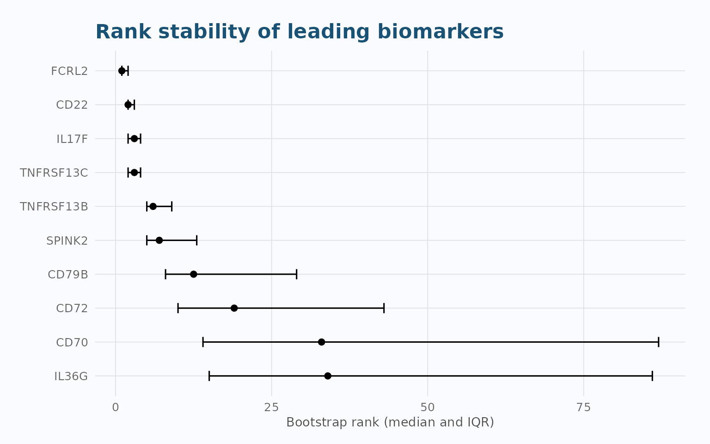
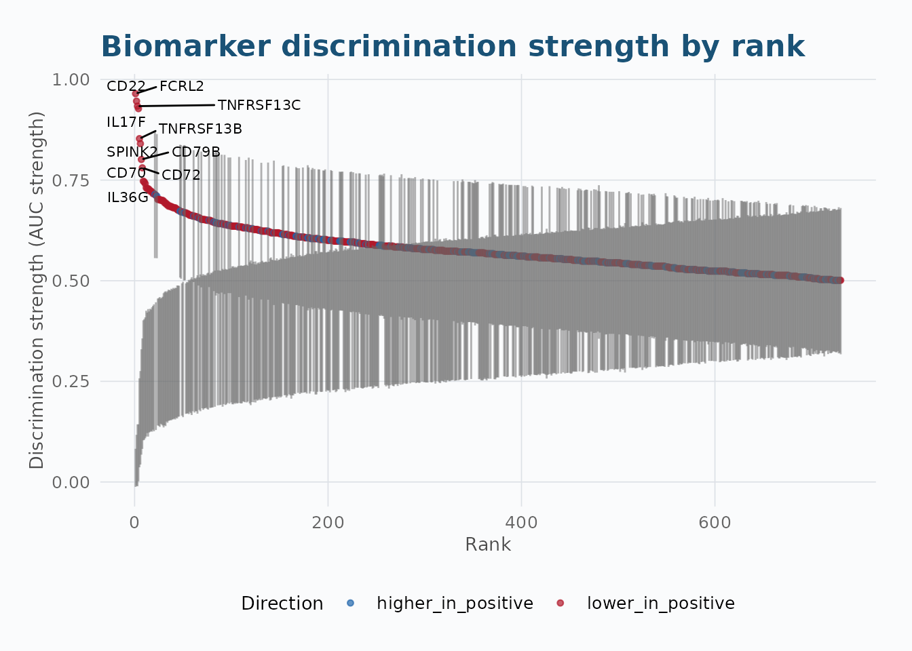
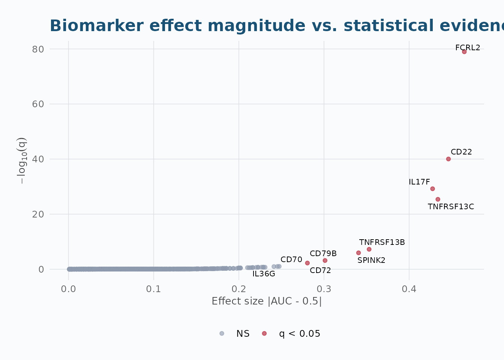

# Real-Data Application: BeatMG Proteomics

``` r

library(aucmat)
```

## Overview

Every other vignette in this package uses simulated data with known
ground truth – useful for validating methodology, but it can’t show what
[`aucmat()`](https://vanhungtran.github.io/aucmat/reference/aucmat.md)
actually finds in a real biomarker matrix. This vignette does that,
using plasma Olink proteomics from **BeatMG** (NeuroNEXT NN102), a
randomized, double-blind, placebo-controlled trial of rituximab for
myasthenia gravis.

Rituximab is an anti-CD20 monoclonal antibody that depletes B cells.
That gives us a real, mechanistically falsifiable question to screen
for: *does the plasma proteome show rituximab’s effect, and if so,
through which proteins?* Two datasets ship with `aucmat`:

- `beatmg_baseline`: 48 subjects, pre-treatment (Timepoint 1)
- `beatmg_ontreatment`: 44 subjects, on-treatment (Timepoint 3 – the
  latest collection with enough samples for AUC inference; Timepoint 4
  has only 5)

Both are Olink Inflammation + Inflammation_II panels (730 proteins),
quality-controlled
([`?beatmg_baseline`](https://vanhungtran.github.io/aucmat/reference/beatmg_baseline.md)
for exact QC criteria). Randomization means baseline should show *no*
systematic biomarker–arm association – that makes it a real-data
negative control, not just a second discovery run.

------------------------------------------------------------------------

## 1. The Raw Data

``` r

data(beatmg_baseline)
data(beatmg_ontreatment)
dim(beatmg_baseline)
#> [1]  48 732
dim(beatmg_ontreatment)
#> [1]  44 732
table(beatmg_baseline$arm)
#> 
#>   Placebo Rituximab 
#>        26        22
```

``` r

DT::datatable(
  beatmg_ontreatment[, 1:12],
  caption = "On-treatment data (first 10 proteins shown; 730 total columns)",
  options = list(pageLength = 10, scrollX = TRUE)
)
```

``` r

head(beatmg_ontreatment[, 1:12])
```

------------------------------------------------------------------------

## 2. Per-Biomarker Descriptive Statistics

Before screening, look at what’s actually in the matrix: distribution of
each protein’s NPX values, plus its raw AUC against treatment arm.

``` r

protein_cols <- setdiff(names(beatmg_ontreatment), c("SampleID", "arm"))
X <- as.matrix(beatmg_ontreatment[, protein_cols])
y <- beatmg_ontreatment$arm

fit <- aucmat(X, y, positive = "Rituximab", ci = "delong", adjust = "BH")

desc <- data.frame(
  biomarker = protein_cols,
  mean      = colMeans(X),
  sd        = apply(X, 2, stats::sd),
  min       = apply(X, 2, min),
  max       = apply(X, 2, max)
)
biomarker_summary <- merge(
  desc,
  fit$results[, c("biomarker", "auc_raw", "conf_low", "conf_high",
                   "p_value", "q_value")],
  by = "biomarker"
)
biomarker_summary <- biomarker_summary[order(-abs(biomarker_summary$auc_raw - 0.5)), ]
biomarker_summary[, -1] <- round(biomarker_summary[, -1], 4)
```

``` r

DT::datatable(
  biomarker_summary,
  caption = "Per-biomarker NPX distribution and AUC (ranked by |AUC - 0.5|)",
  options = list(pageLength = 10, scrollX = TRUE)
)
```

``` r

head(biomarker_summary, 10)
```

------------------------------------------------------------------------

## 3. Screening: Baseline vs. On-Treatment

### 3.1 Baseline (randomization check)

``` r

fit_baseline <- aucmat(
  as.matrix(beatmg_baseline[, protein_cols]), beatmg_baseline$arm,
  positive = "Rituximab", ci = "delong", adjust = "BH"
)
sum(fit_baseline$results$q_value < 0.05, na.rm = TRUE)
#> [1] 0
```

Zero proteins reach `q < 0.05` out of 730 tested. That’s the expected
result under randomization – and it rules out an easy alternative
explanation for whatever the on-treatment screen finds (a systematic
batch/plate artifact would show up at every timepoint, not appear only
on-treatment).

### 3.2 On-treatment (discovery)

``` r

print(fit)
#> <aucmat_screen>  730 biomarkers
#>   Outcome: 21 positive / 23 negative  (positive = Rituximab)
#>   CI: delong  |  adjust: BH  |  na_action: featurewise
#> 
#> Top biomarkers by discrimination strength:
#>  rank biomarker    auc_raw auc_strength  effect_direction      p_value
#>     1     FCRL2 0.03519669    0.9648033 lower_in_positive 1.463140e-82
#>     2      CD22 0.05383023    0.9461698 lower_in_positive 2.518321e-43
#>     3 TNFRSF13C 0.06625259    0.9337474 lower_in_positive 2.205989e-28
#>     4     IL17F 0.07246377    0.9275362 lower_in_positive 2.412965e-32
#>     5 TNFRSF13B 0.14699793    0.8530021 lower_in_positive 3.884484e-10
#>     6    SPINK2 0.15942029    0.8405797 lower_in_positive 9.020337e-09
#>     7     CD79B 0.19875776    0.8012422 lower_in_positive 6.445843e-06
#>     8      CD72 0.21946170    0.7805383 lower_in_positive 6.103983e-05
#>     9      CD70 0.25258799    0.7474120 lower_in_positive 1.138934e-03
#>    10     IL36G 0.25465839    0.7453416 lower_in_positive 1.329868e-03
#>       q_value status
#>  1.068092e-79     ok
#>  9.191872e-41     ok
#>  4.025929e-26     ok
#>  5.871549e-30     ok
#>  5.671346e-08     ok
#>  1.097474e-06     ok
#>  6.722093e-04     ok
#>  5.569884e-03     ok
#>  9.238017e-02     ok
#>  9.708033e-02     ok
sum(fit$results$q_value < 0.05, na.rm = TRUE)
#> [1] 8
hits <- fit$results[!is.na(fit$results$q_value) & fit$results$q_value < 0.05, ]
hits[order(hits$auc_raw), c("biomarker", "auc_raw", "conf_low", "conf_high", "q_value")]
#>   biomarker    auc_raw     conf_low  conf_high      q_value
#> 1     FCRL2 0.03519669 -0.012132437 0.08252581 1.068092e-79
#> 2      CD22 0.05383023 -0.009533702 0.11719416 9.191872e-41
#> 3 TNFRSF13C 0.06625259 -0.010686125 0.14319130 4.025929e-26
#> 4     IL17F 0.07246377  0.001692886 0.14323465 5.871549e-30
#> 5 TNFRSF13B 0.14699793  0.036450631 0.25754523 5.671346e-08
#> 6    SPINK2 0.15942029  0.043292629 0.27554795 1.097474e-06
#> 7     CD79B 0.19875776  0.067878522 0.32963701 6.722093e-04
#> 8      CD72 0.21946170  0.082300650 0.35662275 5.569884e-03
```

Eight proteins are significant at on-treatment, all with `auc_raw < 0.5`
– systematically *lower* under rituximab. Six of the eight (`FCRL2`,
`CD22`, `TNFRSF13C`/BAFF-R, `TNFRSF13B`/TACI, `CD79B`, `CD72`) are
canonical B-cell surface or B-cell-survival-signaling proteins. Finding
exactly these suppressed in a blinded, randomized comparison is the
textbook pharmacodynamic signature of anti-CD20 B-cell depletion – not
an after-the-fact story fit to noise.

Cross-checking against bootstrap CI (small per-arm n here, ~21-23, is
below where DeLong’s asymptotic coverage is fully reliable):

``` r

fit_boot <- aucmat(X, y, positive = "Rituximab", ci = "bootstrap",
                    boot_n = 1000, adjust = "BH", seed = 42)
sum(fit_boot$results$q_value < 0.05, na.rm = TRUE)
#> [1] 8
```

Same eight proteins, in close numerical agreement – DeLong is not
misleading us here despite the small sample.

------------------------------------------------------------------------

## 4. Validation: Is the Ranking Stable?

A single screen is not evidence of a stable ranking.
[`auc_stability()`](https://vanhungtran.github.io/aucmat/reference/auc_stability.md)
resamples (stratified by arm) and reports how often each protein
actually lands in the top-k.

``` r

stab <- auc_stability(X, y, positive = "Rituximab",
                       times = 1000, top_k = c(8, 15, 25), seed = 42)
print(stab)
#> <aucmat_stability>  1000/1000 successful replicates
#> Top biomarkers by median rank:
#>  biomarker rank_median rank_q25 rank_q75  auc_mean     auc_sd top1_freq
#>      FCRL2         1.0        1        2 0.9644679 0.02436425     0.536
#>       CD22         2.0        2        3 0.9458282 0.03424279     0.204
#>      IL17F         3.0        2        4 0.9281180 0.03674590     0.120
#>  TNFRSF13C         3.0        2        4 0.9322899 0.04041137     0.182
#>  TNFRSF13B         6.0        5        9 0.8509565 0.05592214     0.002
#>     SPINK2         7.0        5       13 0.8388965 0.05815289     0.002
#>      CD79B        12.5        8       29 0.8002484 0.06711257     0.000
#>       CD72        19.0       10       43 0.7772940 0.06949358     0.000
#>       CD70        33.0       14       87 0.7469503 0.07434912     0.000
#>      IL36G        34.0       15       86 0.7455217 0.07481954     0.000
plot_auc_stability(stab, n_label = 10)
```



The eight significant hits split into two stability tiers: `FCRL2`,
`CD22`, `IL17F`, `TNFRSF13C` are rock-stable (top-8 in essentially every
resample); `TNFRSF13B` and `SPINK2` are moderately stable; `CD79B` and
`CD72` are fragile – most resamples do *not* reproduce them in the top
8. Report the last two with more caution than the first six.

------------------------------------------------------------------------

## 5. Visualization

``` r

plot_auc_rank(fit, n_label = 10)
```



``` r

plot_auc_volcano(fit, n_label = 10, q_cutoff = 0.05)
```



------------------------------------------------------------------------

## Scope and Limitations

This analysis shows rituximab’s expected pharmacodynamic effect on
circulating B-cell markers – it is **not** a clinical efficacy or
treatment-response result. `beatmg_baseline`/`beatmg_ontreatment` carry
only randomized arm, not the trial’s clinical endpoints (MG-ADL, QMG,
prednisone-sparing outcome), which are not part of this data release.
The datasets are also an available-case subset (44-48 of 52 randomized
participants, two of four Olink panels) rather than the full cohort or
proteome.

## Summary

| Step | Function | Key output |
|----|----|----|
| Load real data | `data(beatmg_baseline)`, `data(beatmg_ontreatment)` | Subject x protein NPX matrix + randomized arm |
| Screen | [`aucmat()`](https://vanhungtran.github.io/aucmat/reference/aucmat.md) | Direction-preserving AUCs with DeLong/bootstrap CIs and q-values |
| Validate | [`auc_stability()`](https://vanhungtran.github.io/aucmat/reference/auc_stability.md) | Bootstrap rank-stability, top-k selection frequency |
| Visualize | [`plot_auc_rank()`](https://vanhungtran.github.io/aucmat/reference/plot_auc_rank.md), [`plot_auc_volcano()`](https://vanhungtran.github.io/aucmat/reference/plot_auc_volcano.md), [`plot_auc_stability()`](https://vanhungtran.github.io/aucmat/reference/plot_auc_stability.md) | Publication-ready plots |
